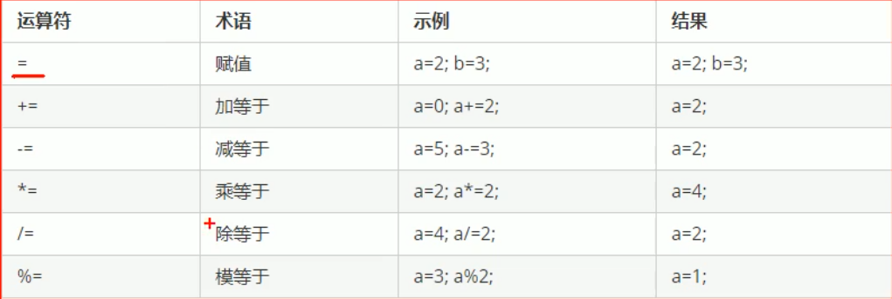

# ++基础入门

## 注释

* 单行：// 注释内容
* 多行：/* 注释内容 */

## 变量

作用：给一段指定的内存空间取名，方便操作这段内存

语法：数据类型 变量名 = 初始值；

## 常量

作用：用于记录程序中不可更改的数据

c++定义常量的两种方式

1. #define宏常量：#define 常量名 常量值 ，通常在文件上方定义
2. const修饰的变量：const 数据类型 常量名 = 常量值，通常在变量前加const，表示不可修改的量

## 标识符命名规则

* 不能是关键字
* 只能由字母，数字，下划线组成
* 第一个字符必须是字母和下划线
* 标识符字母分大小写

## 数据类型

C++规定在创建变量或常量的时候，必须指定相应的数据类型，否则无法分配变量

### 整形

作用：整形变量表示整数数据类型

C++能够表示整数的类型，有多种，区别在于占用内存不同

### sizeof关键字

作用：统计数据类型所占用内存的大小

语法：sizeof(数据类型/变量)

### 实型

作用：用于表示小数

浮点型变量分为两种：

1. 单精度
2. 双精度

两者的区别是表示的有效数字范围不同，默认情况下，输出小数，会显示6位有效数字

科学计数法：3e2表示3*10^2，3e-1表示3 * 10^-1

### 字符型

作用：字符型变量用于显示单个字符

语法：char ch = 'a'

> 注意1：在显示字符型变量时，用单引号将字符括起来，不要用双引号
>
> 注意2：单引号内只能有一个字符，不可以是字符串

* C与C++字符型变量只占一个字节
* 字符型变量不是把字符本身存储，而是存储对应的ascii码

### 转义字符

作用：用于表示一些不能显示出来的ASCII字符

我们常用\\\,\n,\t

### 字符串

作用：表示一串字符

两种风格：

* C语言风格：字符数组：char 变量[] = ""
* C++风格：string 变量名 = ""

### bool类型

作用：代表真和假

bool只要是非0的值，都代表真

## 运算符

* 算术运算符
* 逻辑运算符
* 赋值运算符
* 比较运算符

### 算术运算符

### 赋值运算符

作用：给表达式赋新值

### 比较运算符

作用：用于运算符的比较

### 逻辑运算符

作用：根据表达式的值返回真和假

## 程序流程控制

* 条件：if三大帅，switch
* 循环：for，while，do-while
* 跳转：break，continue，goto

### goto语句

作用：可以无条件跳转语句，但是尽量少使用，以免程序流程混乱

语法：goto 标记; 

标记语法：标记名：(标记一般独占一行)

解释：如果标记的名称存在，执行goto语句时，会跳转到标记位置

