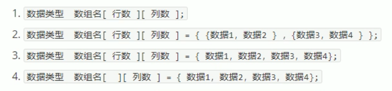

#  

## 数组

数组就是一个集合，里面存放了相同类型的数据元素

特点1：每个数据元素是同一数据类型

特点2：存储在连续的内存空间

### 一维数组

定义方式：

1. 数据类型 数组名[数组长度]
2. 数据类型 数组名[数组长度] = {...}
3. 数据类型 数组名[] = {...}

### 一维数组数组名

用途：

1. 可以统计整个数组在内存中的大小
2. 可以获取数组的首地址

### 二维数组

定义方式：



 存在自动分配机制

### 二维数组数组名

用途：

* 查看二维数组所占的空间
* 获取二维数组首地址

## 函数

作用：将一段经常使用的代码封装起来，减少重复代码的使用

### 函数定义

步骤：

1. 返回值类型
2. 函数名
3. 参数表列
4. 函数体语法
5. return 返回值

### 函数声明

1. 返回值类型
2. 函数名
3. 参数列表

声明可以写多次

### 函数的分文件编写

作用：让代码结构更加清晰

函数分文件编写一般分以下步骤：

1. 创建后缀名为.h的头文件
2. 创建后缀名为.cpp的源文件
3. 在头文件上中写函数声明
4. 在源文件重写函数定义

## 指针

### 指针的基本概念

指针的作用：通过指针间接访问内存

* 内存编号从0开始记录，一般用十六进制表示
* 可以利用指针变量保存内存

定义与使用

```c++
int a = 3;
// 定义指针
int *pa ;
// 获取地址
pa = &a;
// 使用指针，解引用
cout << *pa << endl;
```

### 指针所占内存空间

在32位操作系统下，指针占4个字节内存空间大小，在64位操作系统中，指针占8个字节内存空间大小

### 空指针和野指针

空指针：指针变量指向内存编号为0的空间，指向NULL

用途：初始化指针变量

注意：空指针指向的空间内存是不可以访问的

```c++
int *p = NULL;
```

野指针：指针变量指向非法的内存空间

### const修饰指针

const修饰指针有三种情况：

1. const修饰指针 --常量指针 --先定义常量，后定义指针
2. const修饰常量 --指针常量 --先定义指针，后定义常量
3. const既修饰指针，又修饰常量

指针常量不能修改指向，常量指针不能通过指针修改值

### 指针和数组

​	可以通过指针访问数组

### 指针和函数

​	可以通过传址传递，来修改值

## 结构体

结构体属于用户自定义的数据类型，允许用户存储不同的数据类型

语法：struct 结构体名 {结构体成员列表}；

结构体使用：struct 结构体名 变量名 = {成员变量1，成员变量2，...}

访问属性：通过变量名.成员变量名

### 结构体数组

作用：将自定义的结构体放入到数组中方便维护

语法：struct 结构体名 数组名[元素个数] = {{}，{}，{}}

### 结构体指针

作用：通过指针操作结构体成员，通过->来访问结构体属性

### 结构体嵌套结构体

作用：结构体的成员可以是另一种结构体

### 结构体做函数参数

作用：将结构体作为参数进行传递

传递方式：

* 传值
* 传址

由于一个结构体所占内存较多，直接传值复制内存不够效率，所以对于结构体做参数，推荐使用传址

### 结构体中const的使用场景

由于我们经常在使用指针作为参数时，又要防止对值得修改，可以使用const修饰符，一旦修改就会报错，可以防止我们对结构体得修改	