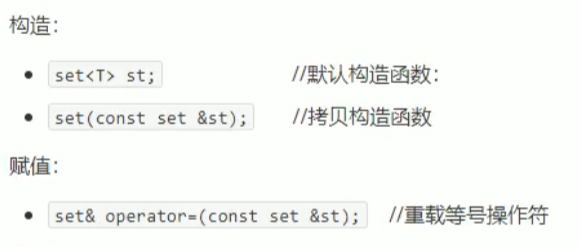
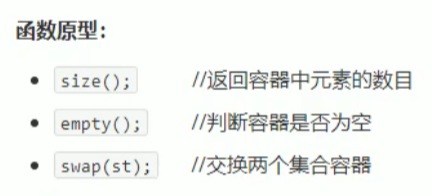

# Set/multiset容器

## 基本概念

简介：

* 所有元素都会在插入时自动排序

本质：

* 关联式容器，底层结构是二叉树实现

set和multiset的区别

* set不允许容器中有重复的元素
* multiset允许有重复操作

## 构造函数

## 插入数据

insert函数：set.insert(num)

* 所有元素在插入时排序
* 不允许插入重复函数

## set大小和交换

功能描述：统计set的容器大小，以及交换set容器

