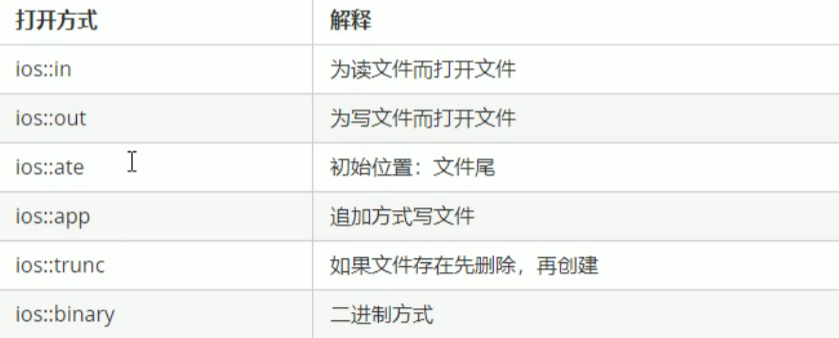

# 文件操作

C++对文件操作需要包含头文件<fstream>

文件类型有两种：

* 文本文件	- 文件以文本ASCII码形式存储到计算机当中
* 二进制文件 - 文件以文本二进制形式存储到计算机当中，用户不能直接读它

操作文件三大类：

* ofstream：写操作
* ifstream：读操作
* fstream：读写操作

## 文本文件

写文件步骤：

1. 包含头文件
2. 创建流对象
3. 打开文件
4. 写数据
5. 关闭文件

```c++
#include<fstream>
using namespace std;
int main(void){
    ofstream fout;
    fout.open("text.txt",ios::out);
    ofs << "姓名：张三";
    fout.close();
}
```

### 打开方式



注意：文件打开方式可以配合使用，利用 | 操作符

例如：用二进制方式写文件 ios::binary | ios::out

### 读文件

读文件步骤：

1. 包含头文件
2. 创建流对象
3. 打开文件并判断文件是否打开成功
4. 读数据
5. 关闭文件

```c++
#include<fstream>
using namespace std;
int main(void){
    ifstream fin;
    fin.open("text.txt");
    if(fin.is_open()){
        cout << "文件已经打开";
    }
   	// 读数据四种方法
    // 第一种
    char buf[1024]={0};
    while(fin >> buf){
        cout << buf << endl;
    }
    // 第二种
    char buf[1024]={0}
    while(fin.getline(buf,sizeof(buf))){
        cout << buf << endl;
    }
    // 第三种
    string buf;
    while(getline(fin,buf)){
        cout << buf << endl;
    }
    // 第四种
    char c;
    while((c = fin.get())!=EOF){
        cout << c;
    }
    fin.close();
    return 0;
}
```

## 二进制文件

