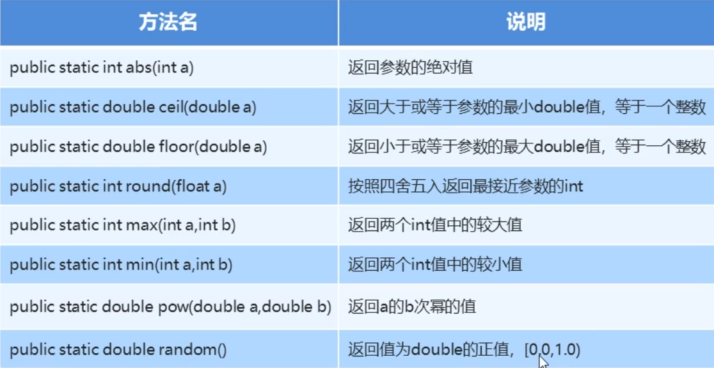
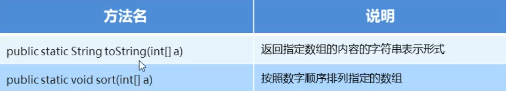
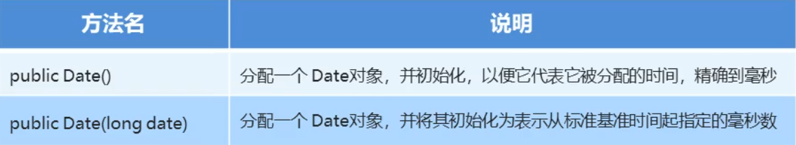

# Java常用工具类和API

## Scanner类

使用步骤：

1. 导包
2. 创建对象
3. 接收数据

```java
import java.util.Scanner;

Scanner sc = new Scanner(System.in);
int a = sc.nextInt();
float f = sc.nextFloat();
```

## Random

作用：产生一个随机数

使用步骤：

1. 导包
2. 创建对象
3. 获取随机数

示例：

``` java
import java.util.Random;

Random r = new Random();
int x = r.nextInt(10);	// 获取0-10之间的数字
int y = r.nextInt(10) + 1; // 获取1-11之间的数字

```

## String

### 概述

### String类在java.lang包下，所以在使用时不需要导包，代表字符串，Java中所有双引号字符都是String对象

* 不可改变，创建后不可以改变值
* 可以被共享
* 相当于字符数组，底层是用byte[]

### 构造方法


### String对象的特点	

1. 通过new的方法是创建对象，由于每一次new都会产生新的空间，所以虽然可能String的内容相同，但内存地址不同
2. 以""的方式，只要内容相同，本质上是同一对象，其底层其实是通过常量池来实现的，如果内容在常量池中出现，那么就是常量池的对象

### 字符串的比较

* 使用 == 比较

对于基本数据类型，比较的是数据值，对于引用类型，比较的是地址值

* 字符串对象，如果希望比较内容，可以通过s.equals(String s2)

### 遍历字符串

```java
// s1 是字符串
for(int i=0;i<s1.length();i++){
    System.out.println(s1.charAt(i));
}
```

## StringBulider

### 概述

是一个可变的字符串对象，在对其进行修改操作时，不会产生新的对象，不会造成空间的浪费

### 构造方法


### StringBuilder添加和反转方法


返回对象本身的意思是直接对对象进行操作，不需要赋值语句对象已经改变

### String和Stringbulider相互转换


## ArrayList

数组是长度固定的存储方式，类似c++的vector，我们可以用array list实现可变数组 

* ArrayList<E>是一种可调整数组集合
* E是特殊的数据类型，泛型

### 构造和添加方法


### ArrayList常用方法


## Math

### 类概况

Math包含执行基本数据运算方法，由于内部的方法是静态的，所以不需要实例化后调用

### Math类常用方法



##  System

### 类概况

System类不能被实例化，而且其内部的方法都是静态方法

### 常用成员方法


## Object

### 类概况

Object是类层次结构的根，每个类都可以将Object作为超类，所有类都可以直接或间接的继承Object类

### 常用方法

toString: 这个是一个打印类信息的方法，当调用print一类的函数时，会自动调用这个方法，可重写

equals: 比较对象的内容是否相等

## Arrays

Arrays类包含用于操作数组的各种方法



工具类的设计思想

* 构造方法用private修饰，这样就无法创建对象
* 成员用public static修饰

## 基本类型包装类

将基本数据类型包装成对象的好处在于可以在对象中定义更多的功能方法操作改该数据，常见操作之一是：用于基本数据类型与字符串之间的转换


### Integer类（其他类可参考）


### 自动装箱和拆箱

* 装箱：把基本数据类型转换成对应的包装类型

* 拆箱：把包装类型转换成对应的基本数据类型

  注意：在使用包装类型的时候，如果做操作，最好先判断是不是null，我们推荐的是，只要是对象，在使用前就必须进行是否为null的操作

## Date

Date代表了一个特定的时间，精确到毫秒



### Date常用方法


### SimpleDateFormat类概述

SimpleDateFormat类是一个具体的类，用于以区域设置敏感的方式格式化和解析日期，我们重点学习日期格式化解析字符


### SimpleDateFormat构造方法


## Calendar

