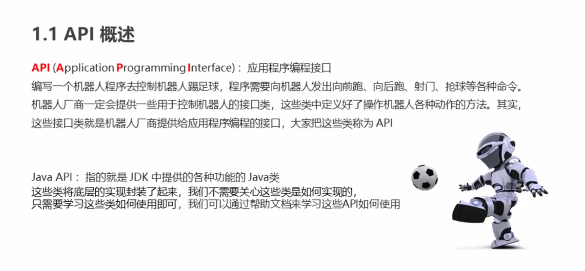
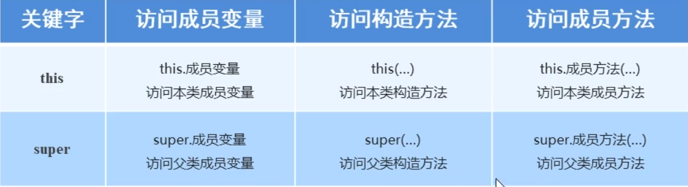
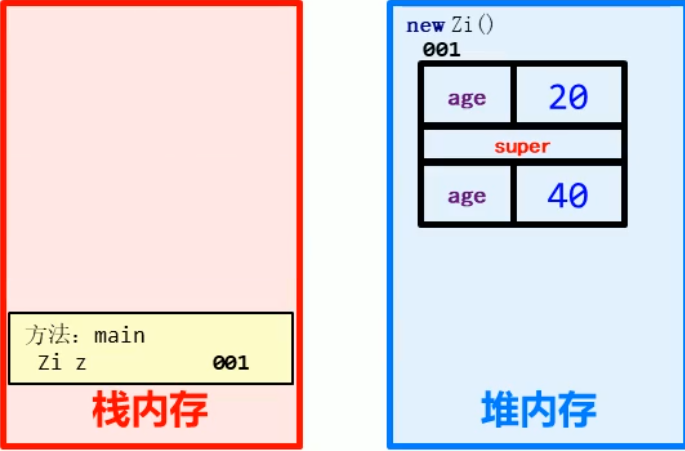

# 面向对象基础

## 类：具有共同属性和行为事物的抽象，类是对象的抽象

属性：对象具有的各种特征，每一个对象每个属性都有特定的值

行为： 对象能够进行的操作

### 类的定义

重要性：是Java程序的基本单位

定义步骤：

1.  定义类
2.  编写类的成员变量
3. 编写类的成员方法

### 对象的使用

创建对象：引用方式创建 Photo a = new Photo()

使用对象：用.来访问方法和属性

## 成员变量和局部变量

成员变量：类中方法外的变量

局部变量：方法中的变量

### 成员变量和局部变量的区别

* 定义位置不同
* 内存位置不同：成员变量在堆内存，局部变量在栈内存
* 生理周期不同：成员变量的生命周期是整个类存在的周期，而局部变量是这个方法
* 初始化方式不同，成员变量有初始化默认值，而局部变量必须初始化才能使用

## 封装

### private关键词

* 是一个权限修饰符
* 可以修饰成员变量
* 作用是不让成员让别的对象使用，只能在本类中使用

针对private修饰的成员变量，如果要让其他对象使用，提供相应的操作

* 提供get方法，获取变量值
* 提供set方法，设置变量值

### this关键词

this指代对象的引用，哪个对象调用方法，this就指代那个变量，常用于当局部变量和成员变量重名时

### 封装

1.封装概述

是面向对象三大特性之一，是面向对象对客观世界的模拟，客观世界的对象隐藏在对象的内部，外界无法直接进行操作

2.封装原则

将类的某些信息隐藏在类的内部，不允许外部程序直接访问，通过private隐藏，提供对应的get和set方法

3.好处

通过方法访问成员信息，提高代码安全性和复用性

### 构造方法

```java
public 类名{
	修饰符 类名(参数){
		方法体
	}
}
// 修饰符一般为public
```

当你没有给出构造方法时，系统默认给出无参构造方法

### 标准类的制作

* 成员变量：用private修饰
* 构造方法：无参和带参
* 成员方法：set和get方法，其他方法，show方法

我们可以通过set方法来设置成员变量值，和带参构造方法来设置

## API(Application Programming Interface)引用程序接口



## 继承

两个类中相同的属性和相同的方法被称为相同特征

继承是面向对象三大特征之一，可以使子类具有和父类一样的属性和方法，也可以在子类追加属性和方法 

格式：public 类名 extends 父类名{}

术语：父类还可成为超类，基类，子类被称为派生类

### 继承的好处和弊端

好处：

* 提高代码的复用性(多个类相同的成员可以放在同一个类中)
* 提高代码的维护性(如果有一个方法需要修改，修改一处即可)

弊端：

* 继承让类之间产生耦合性，削弱了子类的独立性，如果父类改变，子类也要跟着改变

什么时候使用继承？

* 继承提现的关系： is a
* 假设法：如果存在包含关系，那么可以考虑用继承，比如苹果是水果

### 成员变量的访问特点：

访问时存在顺序:

1. 先在局部范围找，除非添加了this
2. 在成员变量范围查找
3. 在父类成员变量范围查找
4. 没找到，报错

### super关键词

super关键词的用法和this类似

* this：代表本类的引用
* super：代表父类存储空间的表示(可以理解为父类对象的引用)



### 继承中构造方法的访问特点

子类所有的构造方法默认调用父类中的无参构造方法

* 子类要初始化父类的数据
* 每一条子类构造方法第一条默认是super()

如果父类中只有带参构造方法，没有无参构造方法

* 通过super调用带参构造方法
* 提供一个无参构造方法 

### 继承中成员方法的访问特点

和变量和访问特点类似，先子后父，实现覆盖方法，可以用super关键词扩展方法，对于每一个对象初始化时，会形成存储父类成员的空间



### 方法重写

概述：子类中出现父类一模一样的方法

应用：子类需要父类的方法，而功能主体子类有自己的特有内容时，可以重写父类的方法，也可以沿袭父类的方法

@override

* 是一个注解
* 可以帮助我们检查重写方法的方法声明

方法重写注意事项：

* 私有方法不能重写
* 子类访问方法权限不能比父类低(public > 默认 > private)，这个说的意思是如果父类是默认的权限，那么子类的修饰符必须是public或者默认，如果父类是public，子类也必须是public
* 不支持多继承，但支持多层继承

