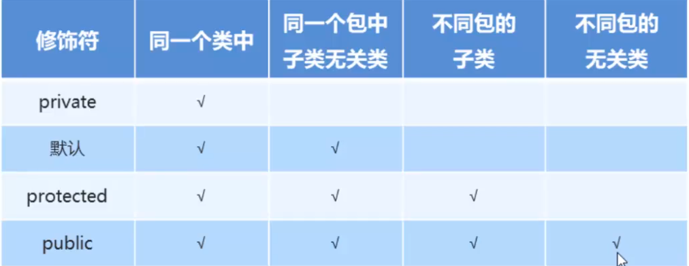

# 面向对象进阶

## 修饰符

### 包

* 其实就说文件夹
* 目的是对类进行管理
* 包也是可以分层的 第一层.第二层.文件

* 可以用import导入

### 修饰符

* 权限修饰符
* 状态修饰符

权限修饰符



状态修饰符

#### final

修饰成员方法，变量，和类

* 修饰方法：不能被重写
* 修饰变量：不能被赋值
* 修饰类：不能被继承

修饰局部变量

* 修饰基本类型，值不能变
* 变量是引用类型，地址值不能变，地址里面的内容可以改变，也就说不能重新new，分配空间

#### static

static是静态的意思，可以修饰方法，也可以修饰成员变量

特点：

* 被类的所有对象共享，也就是修改这个变量后，所有对象的值都是一样的：这也是我们判断是否使用静态关键词字的条件
* 推荐通过类名调用

* 静态的成员方法只能访问静态的成员变量和静态的成员方法

## 多态

概述：同一对象，在不同时刻体现出来的不同形态

多态的前提：

* 有继承/实现方法
* 有方法重写
* 有父类引用指向子类引用

### 多态中成员的访问特点

* 成员变量：编译看左边，执行看左边
* 成员方法：编译看左边，执行看右边

为什么呢：因为成员方法有重写，而成员变量没有

### 多态的好处和弊端

* 好处：提高了程序的扩展性：定义方法的时候，用父类作为参数，在使用的时候，调用子类的方法
* 弊端：不能使用子类的特有功能

### 多态中的转型

* 向上转型：从子到父，父类引用指向子类对象

* 向下转型：从父到子，父类引用转向子类对象

## 抽象类

概述：在java中，一个没有方法体的方法应该定义为抽象方法，而类中如果有抽象方法，该类必须为抽象类，比如说Animal,Cat,Dog中Animal是抽象的类

定义方式：

```java
public abstract class Animal{
    public abstract void eat();
}
```

### 抽象类的特点

* 抽象类和抽象方法必须使用abstract关键词
* 抽象类中不一定有抽象方法，由抽象方法的类一定是抽象类
* 抽象类不能实例化，必须使用多态的方式实例化，这称为抽象类多态
* 抽象类的子类要么重写抽象类中的抽象方法，要么自己本身是抽象类

### 抽象类的成员特点

* 成员变量：可以是变量，也可以是常量
* 构造方法：有构造方法，但是不能实例化，用于子类访问父类数据的初始化
* 成员方法：可以是抽象方法限定不许重写哪些方法，也可以是非抽象方法，提高代码的复用性

## 接口

概述：接口就是一种公共的规范标准，只要符合规范标准，大家都可以通用Java中的接口更多的体现在对行为的抽象

## 接口特点

* 接口用关键字interface修饰

```java
public interface 接口名{}
```

* 类实现接口用implement表示

```java
public class 类名 implement 接口名{}
```

* 接口不能实例化：使用要使用到多态
* 接口的实现类：要么重写接口所有抽象方法，要么本身是抽象类

### 接口的成员特点

* 成员变量：默认修饰符：public static final
* 成员方法：接口没有构造方法，因为接口主要是对行为进行抽象的，是没有具体存在一个类如果没有父类，默认继承Object类
* 成员方法：只能是抽象方法：public abstract

### 类和接口的关系

* 类和类：继承关系，只能单继承，但是可以多层继承
* 类和接口：实现关系，可以单实现，也可以多实现
* 接口和接口：继承，可以单继承，也可以多继承

### 抽象类和接口的区别：

* 成员区别：

抽象类：变量，常量，有各种方法

接口：常量；抽象方法

* 关系区别：

类自能单继承，接口可以多继承，也可以多实现

* 设计理念区别

抽象类：对象抽象，包括属性，方法

接口：对行为抽象，主要是行为

## 形参和返回值

### 类名和接口名作为形参和返回值

* 方法的形参是类名，其实需要的是类的对象
* 方法的返回值是类名，其实返回的是该类的对象
* 当类是抽象类时，其实是调用其中的子类对象
* 接口作为形参和返回值时，需要的是接口的实现类对象

## 内部类

内部类：就说一个类A中定义另一个类B，那么类B被称为内部类

### 内部类的定义格式：

```java
public class Outer{
	修饰符 class Inner{
	
	}
}
```

### 内部类的访问特点

* 内部类可以直接访问外部类的成员，包括私有
* 外部类要访问内部类的成员，必须创建对象

### 内部类的分类：

按照内部类在类中定义的位置不同，可以分成为如下两种形式：

* 在类的成员位置：成员内部类
* 在类的局部位置：局部内部类

局部内部类是在方法中定义的类，所以外界无法直接使用，需要在方法内部创建对象并使用该类访问外部类的成员，也可以访问方法中的局部变量

* 匿名内部类

前提：存在一个类或者一个接口，这里的类可以说具体类也可以是抽象类

格式：

```java
new 接口或对象(){
    重写方法;
};
new Inter(){
    public void show(){
        
    }
}
```

### 匿名内部类在开发中的使用

