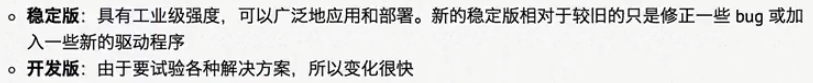
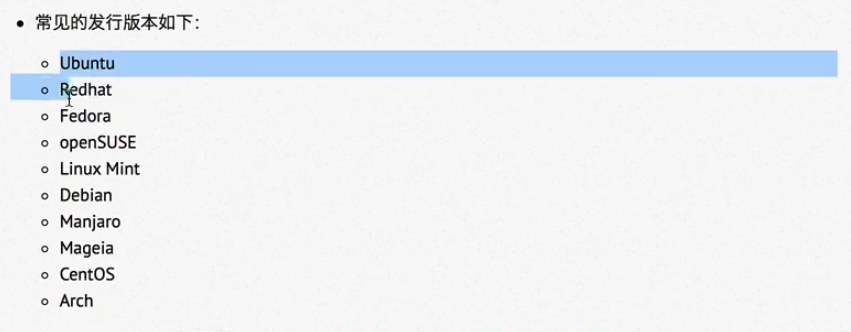
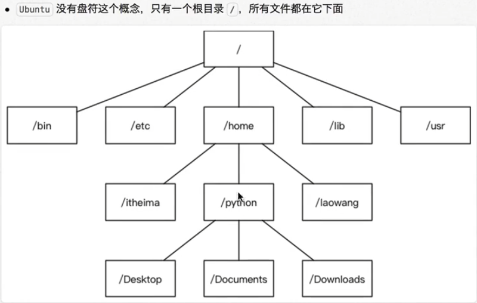

# Linux基础

## Linux内核和开发版

* 内核是系统的心脏，是运行程序和管理磁盘和打印等硬件设备的核心程序，他提供了一个裸机到引用程序的抽象层
* Linux分稳定版和开发版

* 内核源码网址：[http://www.kernel.org](http://www.kernel.org)

### Linux发行版

## Linux文件结构

### 单用户操作系统和多用户操作系统

* 单用户操作系统：指一台电脑，在一段时间只能由一个用户操作和使用，一个用户独享它的所有硬件和软件资源
* 多用户操作系统：指一台计算机在同一时间可以由多个用户使用，多个用户共享它的硬件和软件资源

### window和Linux文件系统的区别

* window：单用户操作系统

> 文件结构为树形结构，由驱动器盘符，每个盘符有过个树形结构

* Linux：多用户操作系统

> 

