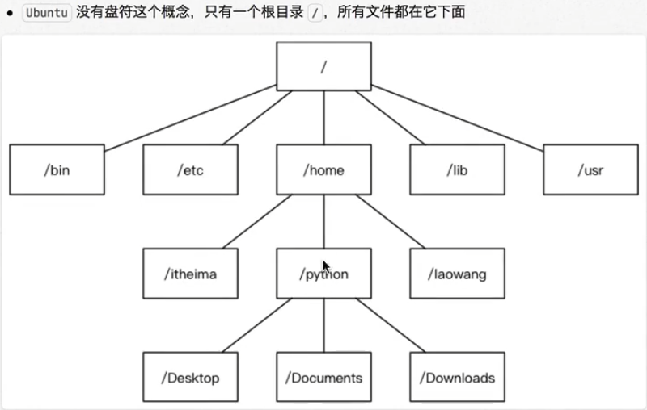

# Linux基础

## Linux内核和开发版

* 内核是系统的心脏，是运行程序和管理磁盘和打印等硬件设备的核心程序，他提供了一个裸机到引用程序的抽象层
* Linux分稳定版和开发版

* 内核源码网址：[http://www.kernel.org](http://www.kernel.org)

### Linux发行版

## Linux应用领域

* 服务器领域

Linux在服务器领域的应用是最高的

Linux免费，稳定，安全等特点在这里得到很好的体现，尤其在高端领域尤为广泛

* 嵌入式领域

Linux运行稳定，对网络的良好支持性，低成本，且可以根据大小进行网络裁剪，内核小的时候可以达到几百KB等特点，在嵌入式领域中的应用得到很大的提高

## Linux文件结构

### 单用户操作系统和多用户操作系统

* 单用户操作系统：指一台电脑，在一段时间只能由一个用户操作和使用，一个用户独享它的所有硬件和软件资源
* 多用户操作系统：指一台计算机在同一时间可以由多个用户使用，多个用户共享它的硬件和软件资源

### window和Linux文件系统的区别

* window：单用户操作系统

> 文件结构为树形结构，由驱动器盘符，每个盘符有过个树形结构

* Linux：多用户操作系统

> 

## Linux目录结构

* 具体目录结构

/bin[常用]：是binary的缩写，目录存放常用的的命令

/sbin：s是super user的意思，这里存放管理员使用的系统管理程序

/home：存放普通用户的主目录，在Linux下每个用户都有自己的子目录，一般该用户名是以用户的账号命名

/root：该目录为管理员目录，也称为超级权限者的用户子目录

/lib：系统开机用到的最基本的动态连接共享目录，其作用类似于windows里面的DLL文件，几乎所有的应用程序都需要用到这个共享库

/lost+found：这个目录一般是空的，而且隐藏，当系统非法关机后，会存放一些文件

/etc：所有的系统所需要的配置文件和子目录，比如安装MySQL数据库my.conf

/user：非常重要的文件夹，用户许多引用程序和文件都在这个文件夹下，类似于windows的program file

/boot：存放Linux的核心文件，包括一些连接文件和镜像文件

/proc[不能动]：这个目录是虚拟目录，是系统内存的映射，访问这个目录来获取系统信息

/srv[不能动]：service缩写，存放一些服务器启动后的需要提取的数据

/sys[不能动]：系统文件夹

/tmp：存放临时文件

/dev：类似window的系统管理器，把所有的硬盘用文件的形式存储

/media：自动识别一些设备

/mnt：为了用户提供挂载的文件系统，可以存储共享文件夹

/opt：给主机额外安装软件的目录

## 远程登录Linux服务器

### 为什么要登录远程服务器

获取ip地址：ifconfig