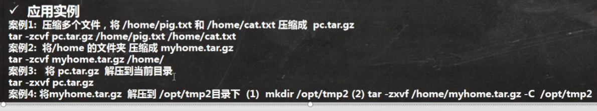

# Linux 指令

## 关机和重启命令

* 基本介绍

> shutdown -h now ：立刻进行关机
>
> shutdown -h 1：1分钟后关机
>
> shutdown -r now：现在重启计算机
>
> halt：关机，作用和前面一样
>
> reboot：现在重启计算机
>
> sync：把内存数据同步到磁盘

* 注意细节

1. 不管是重启还是关机系统，都要运行sync命令，讲数据写入磁盘
2. 目前的shutdown/halt/reboot 命令都会在关机前进行sync，不过：小心使得万年船

## 指定运行级别

###  如何找回root密码

略

## 帮助指令

## 文件目录指令

* pwd指令：显示当前工作目录的绝对路径
* ls指令：ls [选项] [目录或者文件]

查看目录的所有内容信息

常用选项：-a 查看所有内容，包括隐藏文件，-l 以列表的形式显示

* cd指令：cd [参数] (切换到指定目录)

cd ~ ：回到家目录

cd .. :回到上一级目录

* mkdir：mkdir [选项] 创建的目录名

常用选项：-p 创建多级目录

* rmdir：rmdir [选项] 要删除的空目录

使用细节：rmdir删除空目录，如果要强制删除整个目录和内部文件，那么要加 -rf

* touch：创建空文件

* cp：拷贝指令

基本语法：cp [选项] source dest

-r ：递归复制整文件夹

\cp :强制覆盖，无需提示

* rm指令：移除文件或者目录

语法：rm [选项] 要删除的文件或目录 

常用选项：-r 递归删除整个文件夹 	-f 强制删除不提示

* mv指令：移动文件与目录，或者重命名

基本语法：mv  文件1  文件2

如果文件1和文件2在同一个目录下，那么就是重命名，如果不在同一个目录下，那么就是移动文件

* cat指令：查看文件内容，不能修改

基本语法：cat [选项] 要查看的文件

-n 显示行号

* more指令：more指令是一个基于VI编辑器的文本过滤器，它以全屏的方式按页显示文本文件的内容，more指令中内置若干快捷键

基本语法：more 要查看的文件

* less指令：用于分屏查看文件内容，它的功能与more指令类似，但是比more更强大，支持各种显示终端，less指令显示文本内容时，并不是一次将文件加载后显示，而是根据需要显示的内容加载文件，用于大文件查看

基本语法：less 要查看的文件

* echo指令：echo输出内容到控制台

基本语法：echo [选项] [输出内容]

可以输出环境变量到控制台，比如输出$path

* head指令：输出文件开头部分内容，默认情况下head指令显示前10行

语法：head 文件(显示前10行)

head -n 5 文件(显示前5行)

* tail指令：同head用于显示尾部的文件

tail -f ：实时跟踪这个文件的所有更新

* \> 和 \> \> 重定向指令：

基本语法：

* ln指令

* history指令：查看已经执行过的指令

history 查看所有指令

history 5 查看最近执行过的5个指令

## 时间日期类指令

* data指令

查看日期：

> date +%Y：查看年份
>
> date +%m：查看月份
>
> date "+%Y-%m-%d"：自定义查看日期相关信息

* 设置日期：

> date -s "字符串时间"

* cal：查看日历

> 语法：cal [年份]

## 搜索查找指令

* find指令：从指定目录向下递归地bian'li其各个子目录，将满足条件的文件和目录显示在终端

基本语法：find [搜索范围] [选项]

选项说明：

* locate指令：快速定位文件路径

* which指令：查找指令在哪个目录下，比如ls指令在某个目录下：which ls
* grep指令和管道符号：过滤查找，“|”，表示将前一个命令的处理结果输出传递给后面的命令处理

基本语法：grep [选项] 查找内容 源文件

常用选项：

## 压缩和解压

* gzip和gunzip指令：gzip用于压缩文件，gunzip用于解压

基本语法：gizp 文件（把文件压缩成*.gz的文件）gunzip 文件.gz（解压缩文件）

* zip和unzip指令：zip用于压缩文件，unzip用于解压缩，两者在项目打包中有很大的用处

  基本语法：

  > zip [选项] XXX.zip 将要压缩的文件（压缩文件和目录的命令）
  >
  > unzip [选项] XXX.zip(解压缩文件)

常用选项：

* tar指令：打包指令，最后打包的文件是.tar.gz的文件

基本语法：tar [选项] XXX.tar.gz 打包的内容（打包目录），如果有多个文件，中间用空格隔开

常用选项

应用实例：

