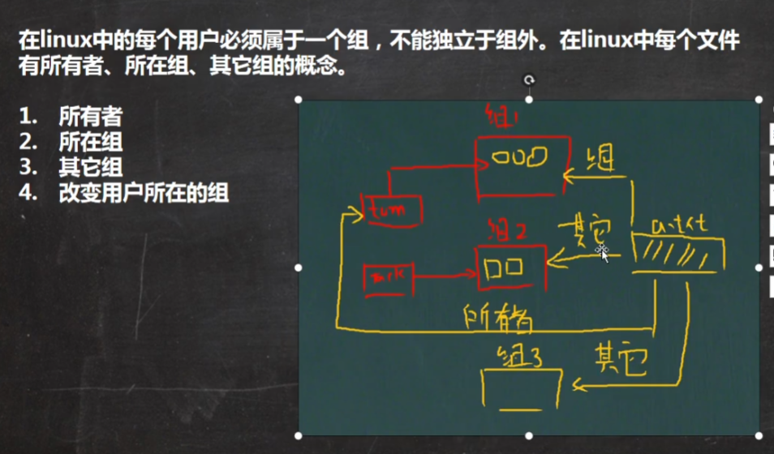
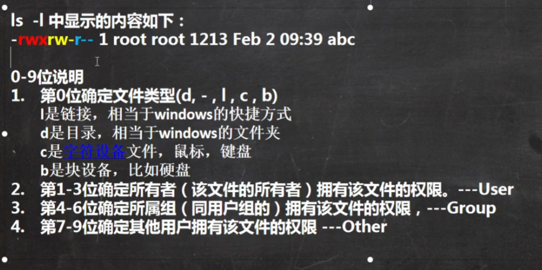
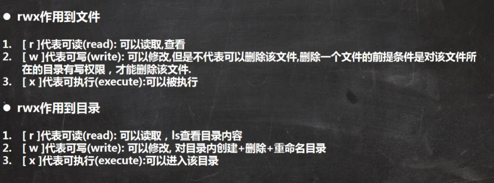
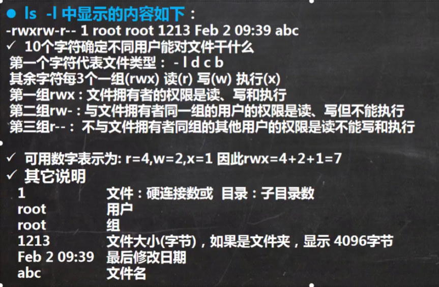
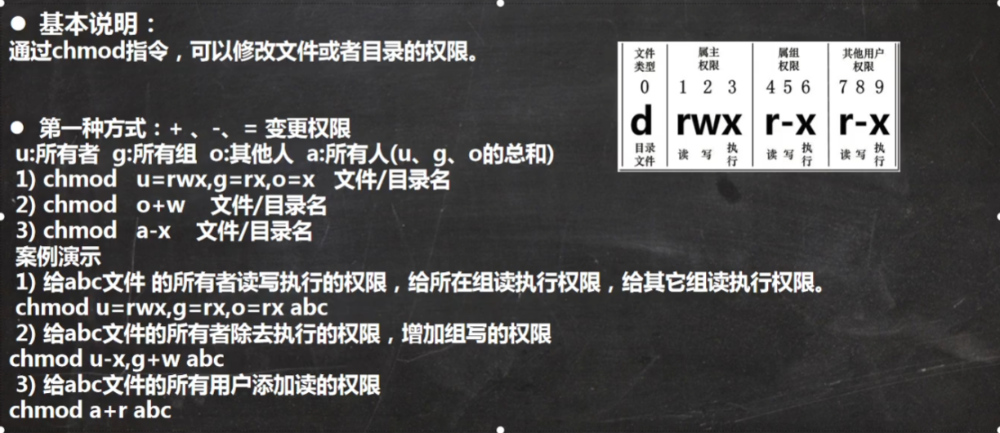
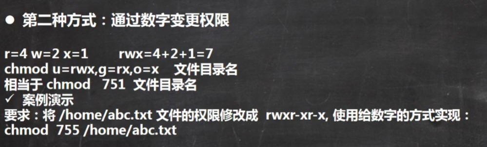
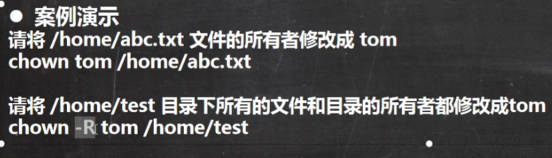

# Linux组管理和权限管理

## Linux组的介绍

## 文件/目录所有者

一般来说，谁创建了文件/目录，谁就是文件的所有者，不过所有者也可以修改

查看所有者：ls -ahl 或者 ll

修改所有者：chown 用户名 文件名

## 组的创建

cat /etc/group 查看存在的组

## 文件/目录所在组

当某个用户创建了一个文件后，这个文件的所在组就是该用户的所在组

查看所在组：ls -ahl 或者 ll

修改文件所在组：chgrp 组名 文件名

## 其他组

除文件的所有者和所在组的用户外，系统的其他用户都是文件的其他组

## 改变用户所在组

在添加用户时，可以指定所在组，如果你有root权限，可以改变某个用户的所在组

* 改变用户所在组

usermod -g 新组名 用户名

usermod -d 目录名 用户名 （改变用户登录的初始目录）

* 特别说明：用户需要有进入到新目录的权限

## 权限的基本介绍

### rwx权限详解

### 文件和目录权限实际案例

## 修改权限

第二种方式：通过数字变更权限

## 修改文件所有者 -chown

基本介绍：

chown	newowner	文件/目录	（改变所有者）

chown	newowner:newgroup	文件/目录	（改变所有者和所有组）

-R 如果是目录，则使其下所有子文件和子目录递归生效

## 修改文件所在组 -chgrp

基本介绍：chgrp	newgroup	文件/目录	（改变所在组）

