# Shell编程

## 什么是shell编程，为什么要学习shell编程？

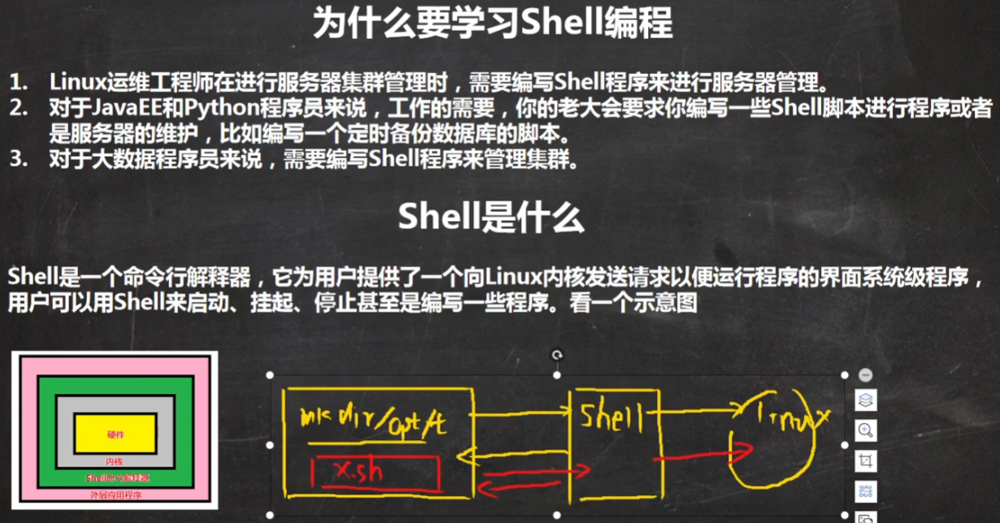

## shell编程实例

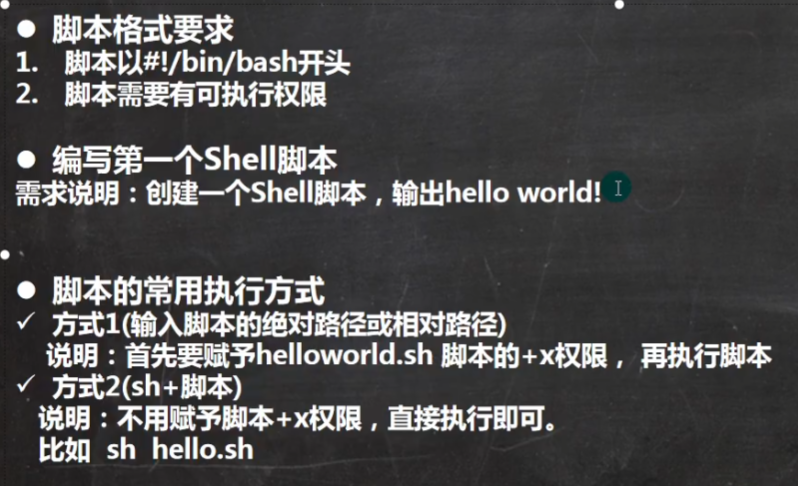

## shell变量

### 变量介绍

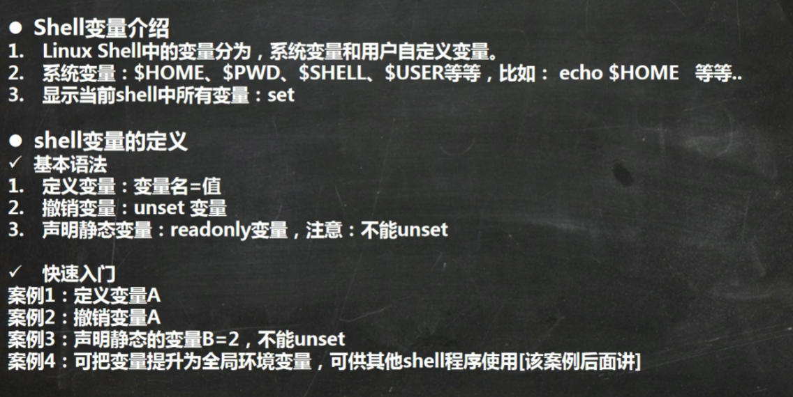

### shell变量的定义

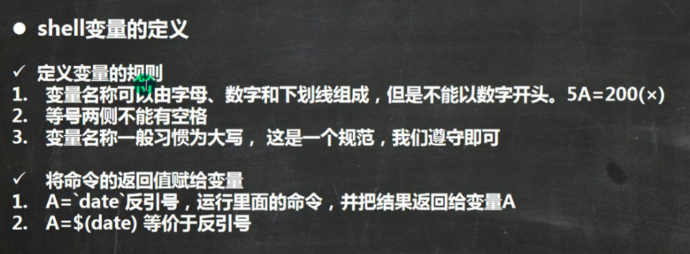

## 设置环境变量

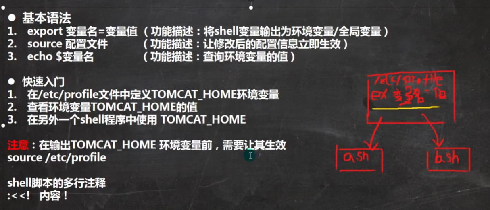

环境变量一定要在/etc/profile下的sh文件中配置，定义环境变量一定要export表示全局，source配置文件，之后就可以输出环境变量

## 设置参数变量

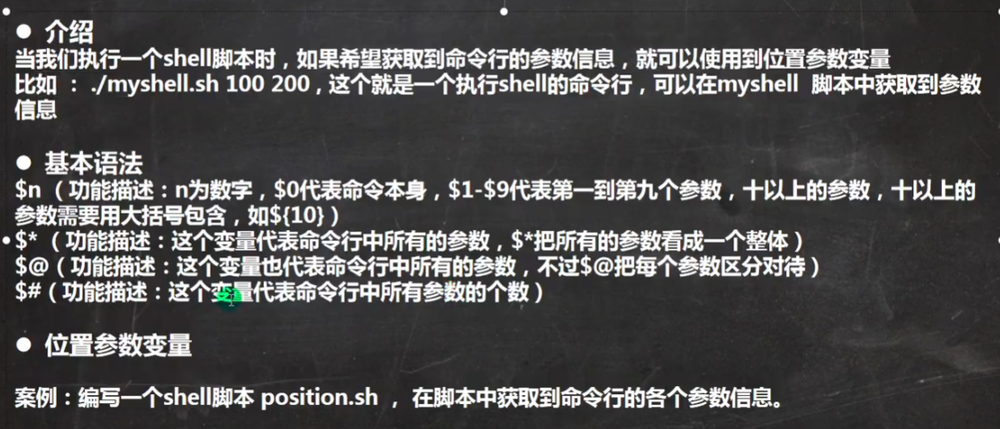

## 预定义变量

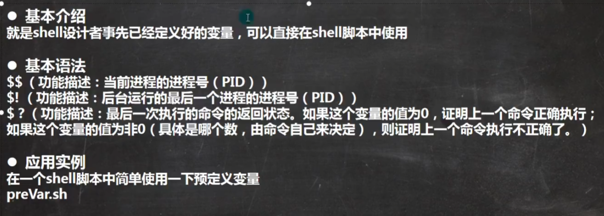

## 运算符

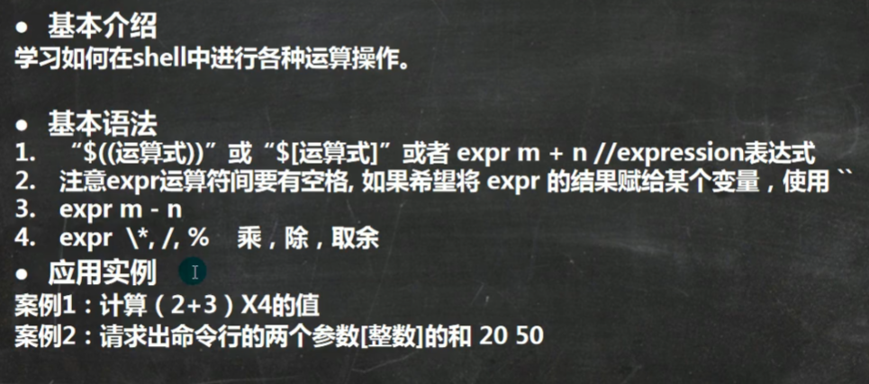

## 条件判断

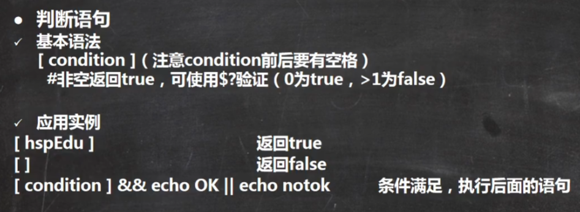

### 判断语句

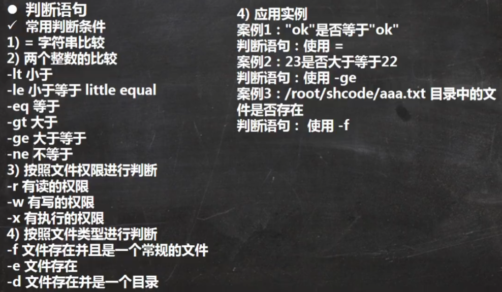

### 流程控制

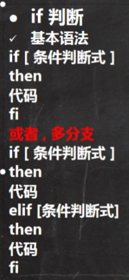

### case语句

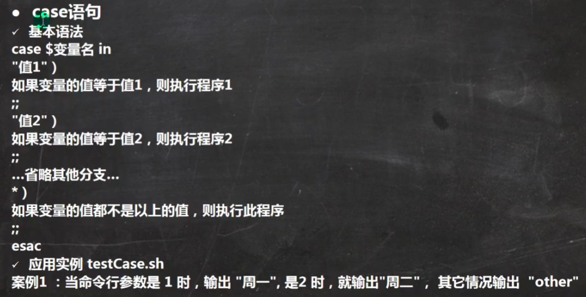

## 循环语句

### for循环

​	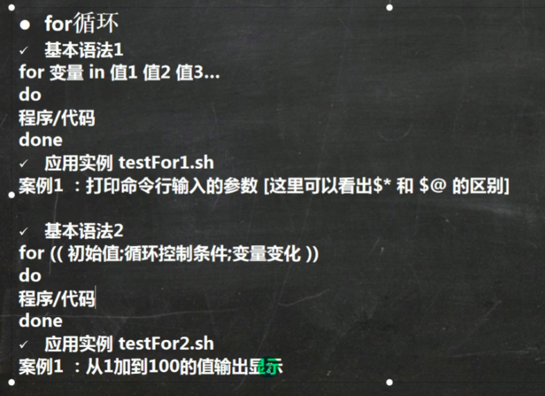

### while循环

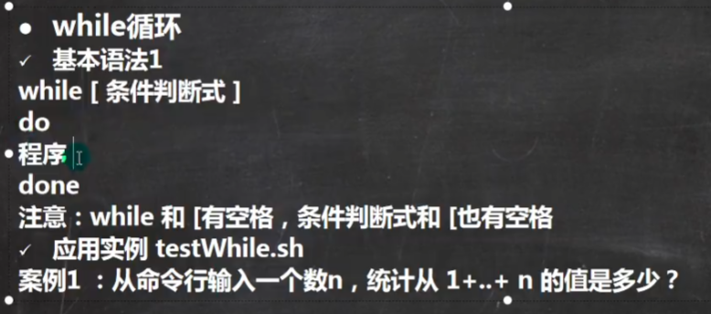

## 交互式程序设计

### read读取控制台输入

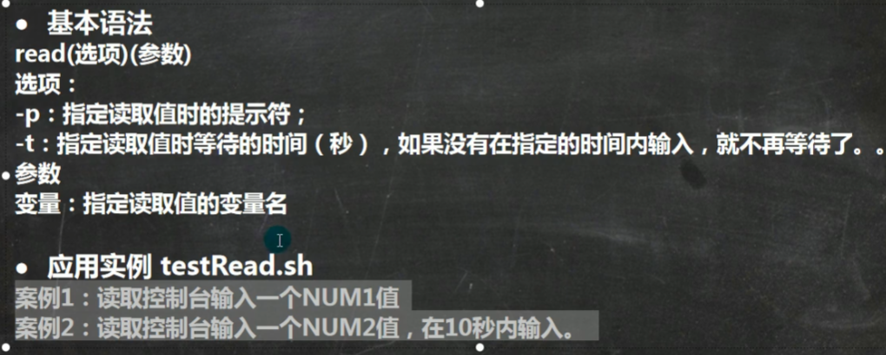

## 函数

### 系统函数

* bashname

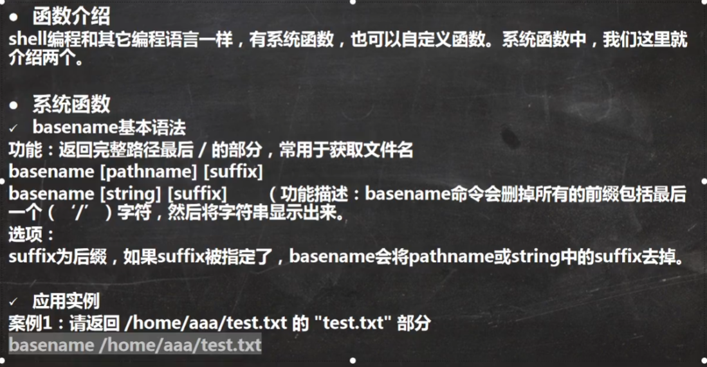

* dirname

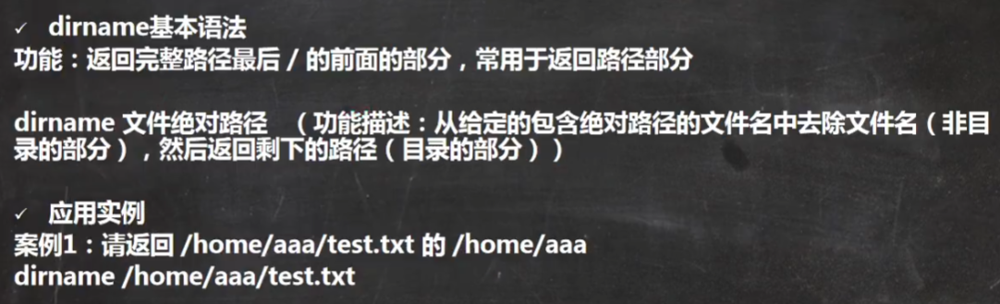

### 自定义函数

