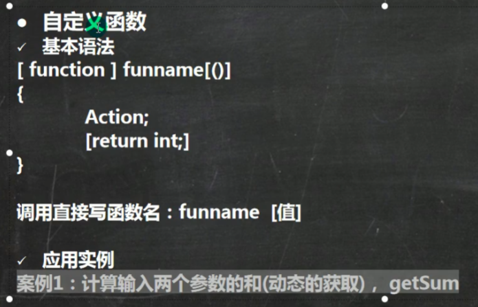

# Shell编程

## 什么是shell编程，为什么要学习shell编程？

## shell编程实例

## shell变量

### 变量介绍

### shell变量的定义

## 设置环境变量

环境变量一定要在/etc/profile下的sh文件中配置，定义环境变量一定要export表示全局，source配置文件，之后就可以输出环境变量

## 设置参数变量

## 预定义变量

## 运算符

## 条件判断

### 判断语句

### 流程控制

### case语句

## 循环语句

### for循环

​	

### while循环

## 交互式程序设计

### read读取控制台输入

## 函数

### 系统函数

* bashname

* dirname

### 自定义函数

