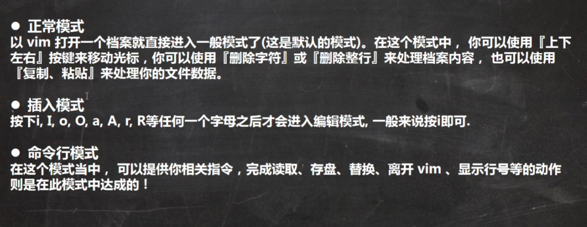
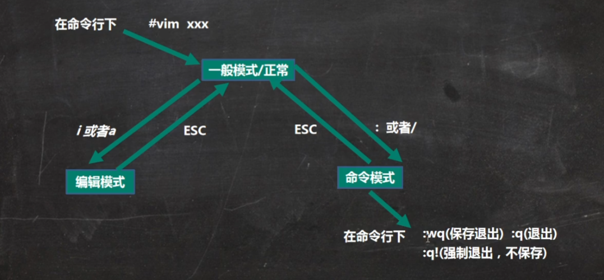
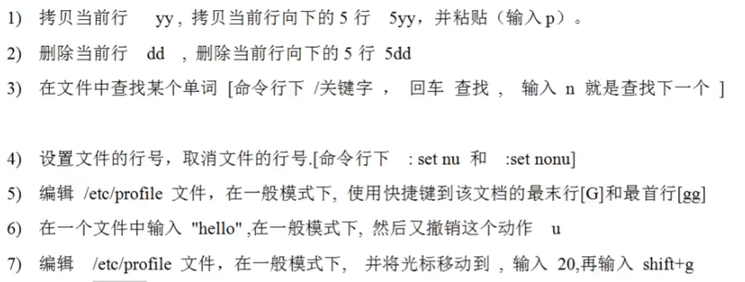

# vi和vim

## vi和vim基本介绍

Linux系统会内置vi文本编辑器

Vim具有程序编辑的能力，可以看作是Vi的增强版本，可以主动的以字体颜色去辨识语法的真确性，方便程序设计，代码补全，编译和错误跳转的功能

## vi和vim常用三种模式

输入esc表示推出，在输入：进入命令行模式

模式切换：

 [(43条消息) 【linux】vi(vim)键盘图及其基本命令_不二的博客-CSDN博客](https://blog.csdn.net/rocling/article/details/82820782) 

