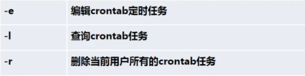
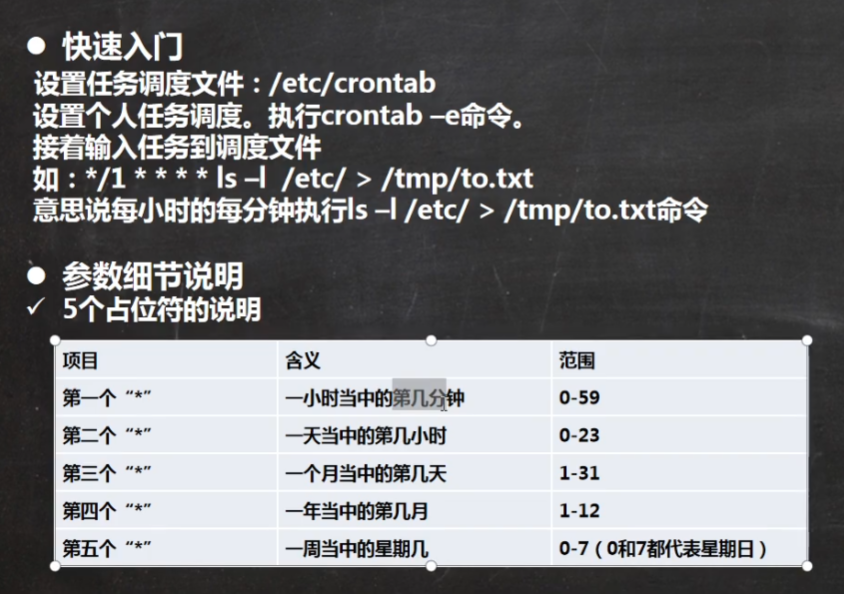
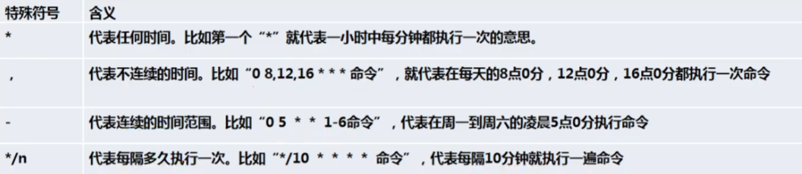
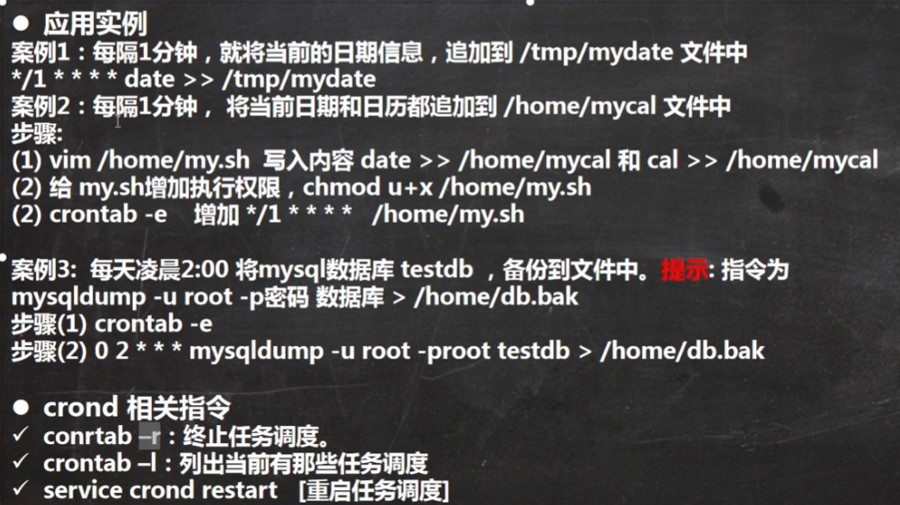
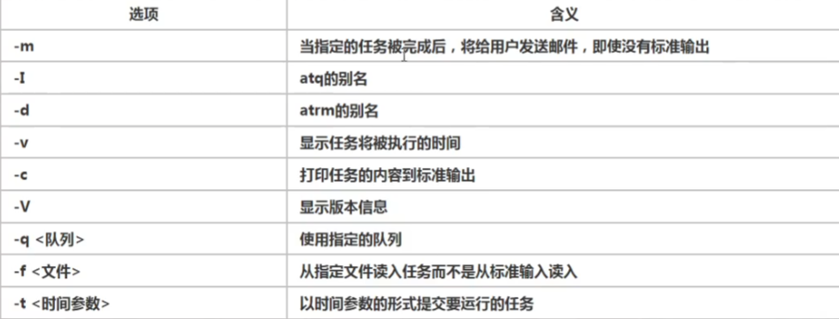
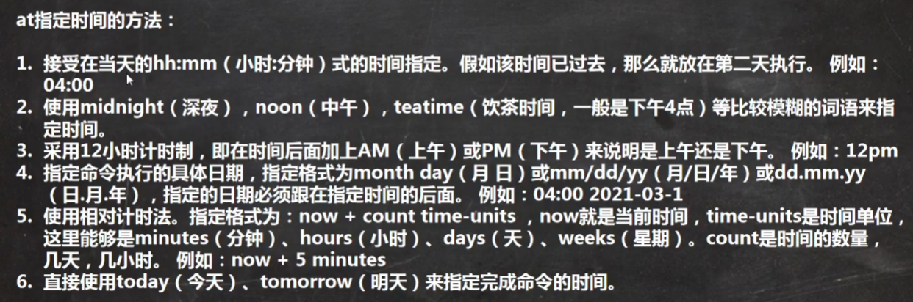
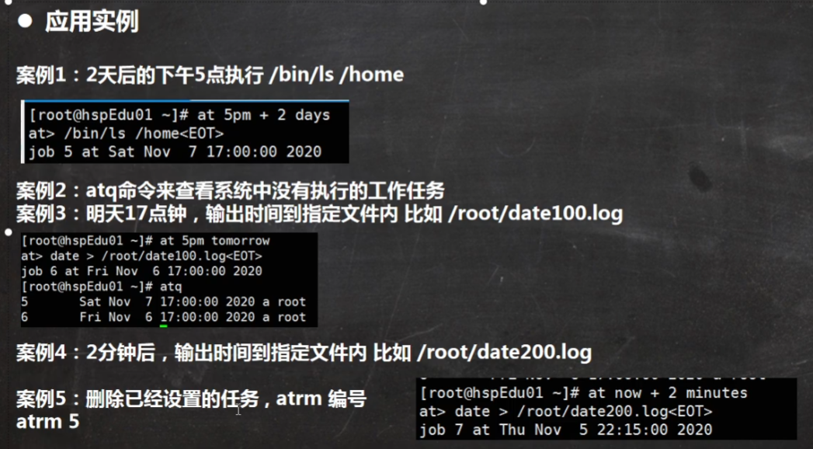

# 定时任务调度

## crond任务调度

* 概述

任务调度：是指系统在某个时间执行的特定的命令和程序

任务调度分类：

1. 系统工作
2. 有重要的工作必须周而复始地执行，如病毒扫描
3. 个别用户工作：个别用户可能希望执行某些程序，比如mysql数据库的备份

* 基本语法

crontab [选项]

* 常用选项

* 快速入门

* 特殊符号说明

* 特殊时间执行任务案例

## at定时任务

### 基本介绍

1. at命令是一次性定时计划任务，at的守护进程atd会以后台模式运行，检查作业队列来进行
2. 默认情况下，atd守护进程每60s检查作业队列，有作业时，会检查作业运行时间，如果时间与当前时间匹配，则运行作业
3. at命令是一次性定时计划任务，执行完一个任务后不在执行此任务
4. 在使用at命令的时候，一定要保证atd进程的启动，可以使用相关指令来查看

ps -ef | grep atd 这个命令是检查进程中是否有atd

### at命令格式

at [选项] [时间]

control + D 结束输入

### at时间定义

### at运用实例

atq命令查看系统中没有执行的工作任务

atrm命令删除任务

