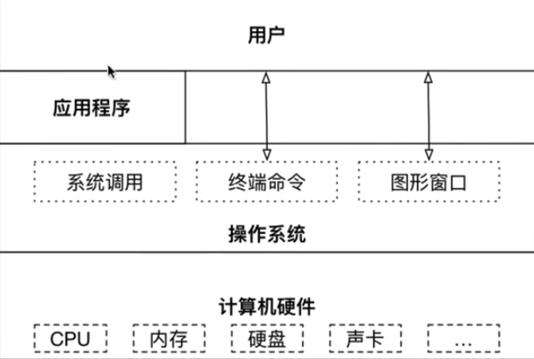

# 操作系统(科普)

## 操作系统

> 操作系统作为接口的示意图

* 没有安装操作系统的计算机，一般称为裸机，如果想在裸机上运行程序，就要用机器语言
* 如果在计算机上安装操作系统，就可以在操作系统上安装支持的高级语言环境，用高级语言开发程序

作用：

1. 直接操作硬件
2. 把操作系统的代码封装成系统调用

## 不同领域的主流操作系统

* 桌面式操作系统
* 服务器操作系统
* 嵌入式操作系统
* 移动设备操作系统

桌面式操作系统

* window：用户群体大，稳定性和安全性欠缺
* macOS：适合开发人员
* Linux：引用软件少

服务器操作系统

服务器本质上是硬件配置高的电脑，我们可以通过远程登陆来维护服务器

* Linux：安全稳定，免费
* window Server：付费

嵌入式操作系统

* Linux

移动式操作系统

* IOS(苹果)
* Android(安卓 基于Linux)

## 虚拟机(Virtual Machine)

虚拟机指通过软件模拟具有完整硬件系统功能的，运行在一个完全隔离环境中的完整的计算机系统

* 虚拟系统通过现有操作系统的全新虚拟镜像，具有真实操作系统完全一样的功能
* 进入虚拟系统后，所有操作都是在这个全新的虚拟系统里面进行，可以独立安装运行软件，保存数据，拥有自己的独立桌面，不会对真正的操作系统产生任何影响
* 而且能够在现有系统和虚拟镜像灵活切换

### 网络连接三种模式

1. 桥接模式：虚拟系统可以和外部系统直接通讯，但是容易造成IP冲突
2. NAT模式：网络地址转换模式，虚拟机可以和外部系统通讯，不造成IP冲突
3. 主机模式：独立的系统

### 虚拟机克隆

如果你已经安装了一台Linux虚拟机，如果你还想在更多，没必要重新安装，你只需要克隆就可以了

1. 方式一：直接拷贝一份安装好的虚拟机文件
2. 方式二：使用VMware克隆操作，注意：克隆时要关闭Linux系统

克隆后的系统的密码软件和其他配置会和原来的虚拟机相类似

### 虚拟机快照

如果你在使用虚拟机的过程中，你想恢复的原先的某个状态，但是又害怕误操作造成系统异常，VMware提供快照管理功能，可以让你回复到原先的某个正常状态

1. 创建快照
2. 快照管理可以跳回某个快照

### 虚拟机迁移和删除

虚拟机的本质是一个文件，因此虚拟机的删除很方便，你可以用安装好的虚拟机文件夹拷贝和剪切到别的文件夹，删除也很简单，可以用VMware移除

### 设置共享文件夹

* 具体方式：设置共享文件夹
* 注意事项：在实际开发过程中，文件上传和下载是需要使用远程方式完成的

## 操作系统发展简史

​	略

