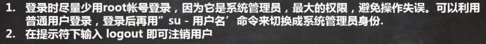
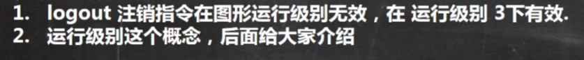
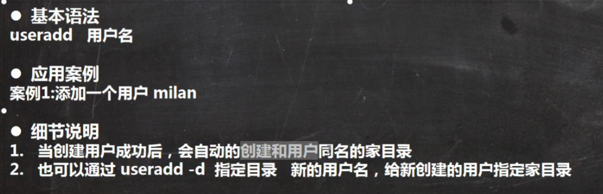
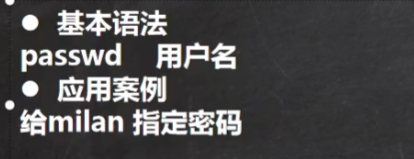
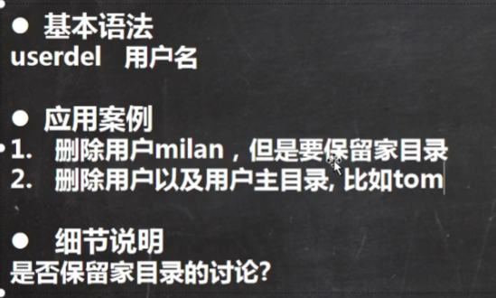
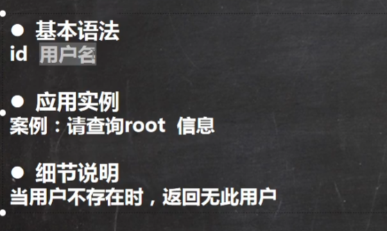
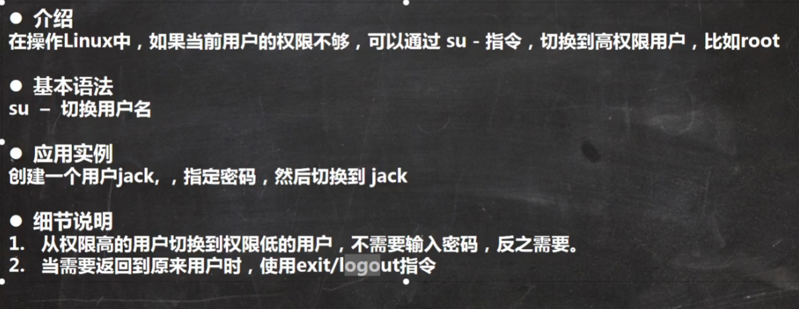
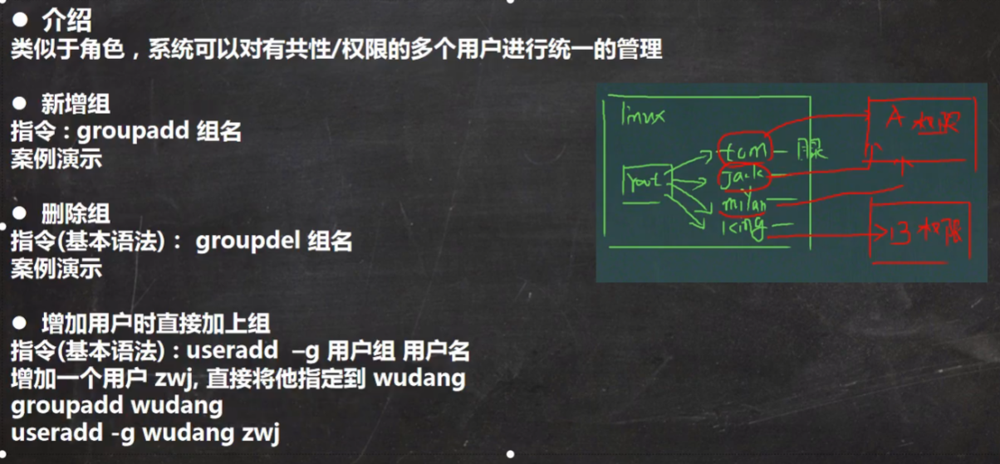
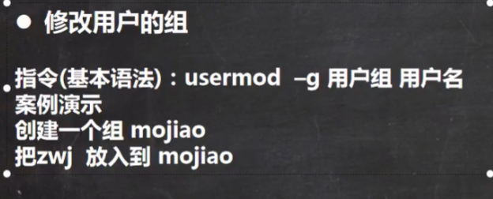
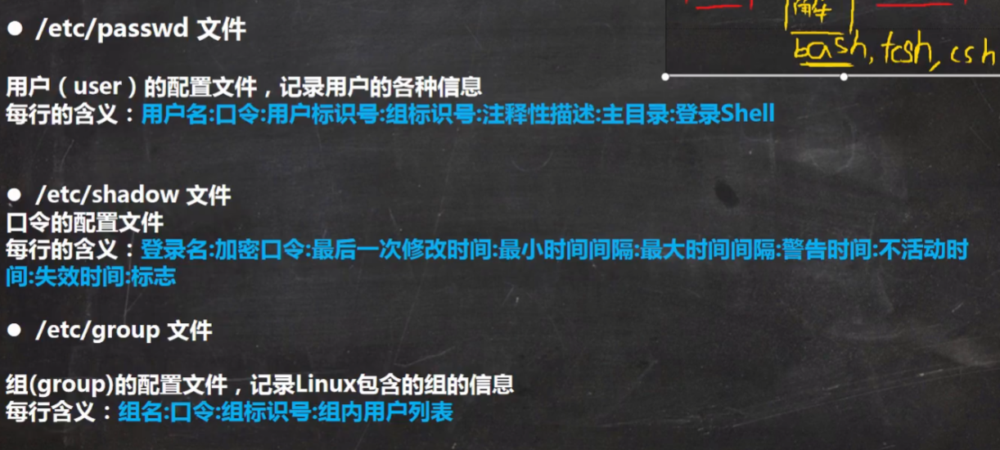

# id用户管理

## 用户登录和注销

* 基本介绍

* 使用细节

## 用户管理

Linux系统是多用户多任务的操作系统，任何一个要使用系统资源的用户，都必须首先向系统管理员申请一个账号，然后用这个账号的身份进入系统

### 添加用户

### 指定修改密码

### 删除 用户

userdel 用户名 ：是把用户删除，但不删除用户家目录的文件

userdel -r 用户名：是删除用户名和家目录

### 查询用户信息

### 切换用户

### 查看当前用户信息

语法：whoami

## 用户组

### 添加组

### 修改用户的组

### 用户和组相关配置文件

