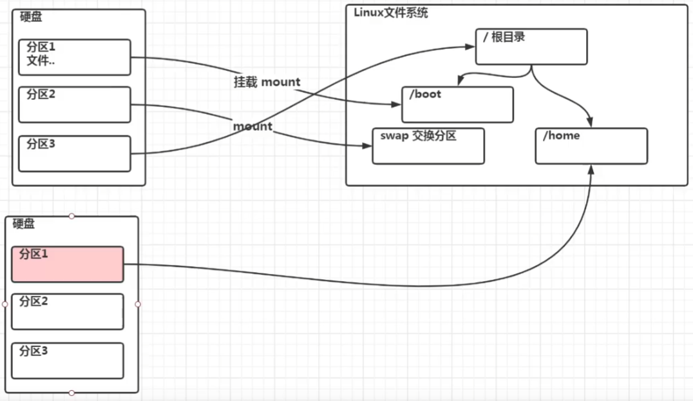
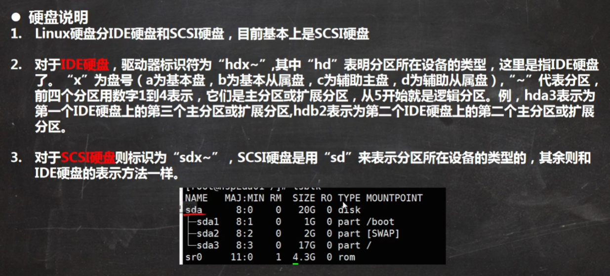
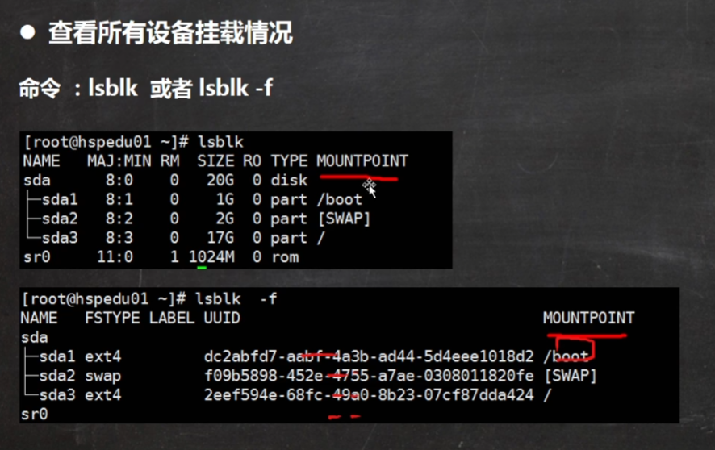
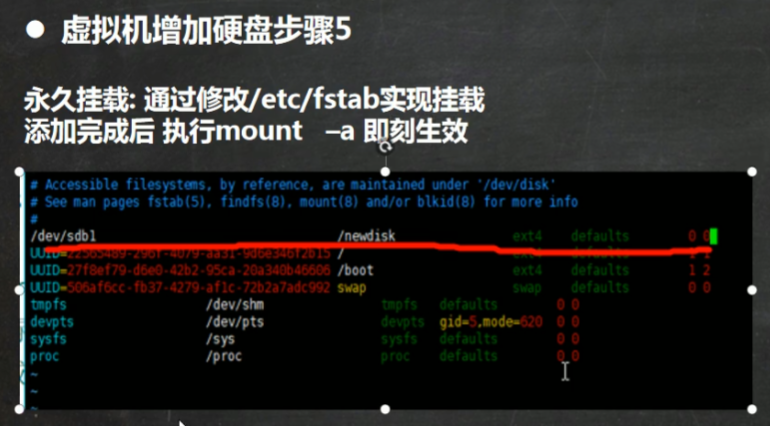
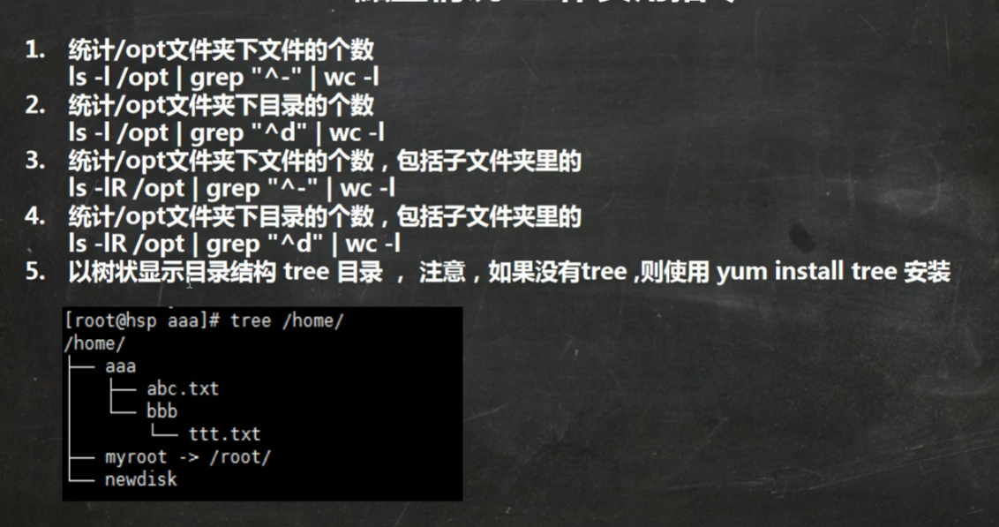

# 磁盘分区和挂载

## 原理介绍

1. Linux无论有几个分区，分给哪个目录使用，归根结底只有一个根目录，一个独立且唯一的文件结构，Linux中每个分区都是用来组成整个文件系统的一部分
2. Linux采用一种叫“载入”的处理方法，它的整个文件系统中包含了一整套的文件和目录，且将一个分区和目录联系起来，这时要载入的一个分区将使它的存储空间在一个目录下获取

## Linux分区

### 查看所有设备挂载情况

## 挂载案例

第一步

第二部

第三步

第四步

 

注意：重启后挂载失效

第五步

## 查询磁盘使用情况

基本语法：df -h查询系统硬盘整体使用情况

du -h 目录 (查询指定目录的硬盘使用情况，默认为当前目录)

选项：

## 磁盘相关的工作使用指令

