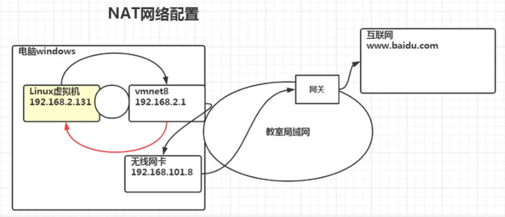
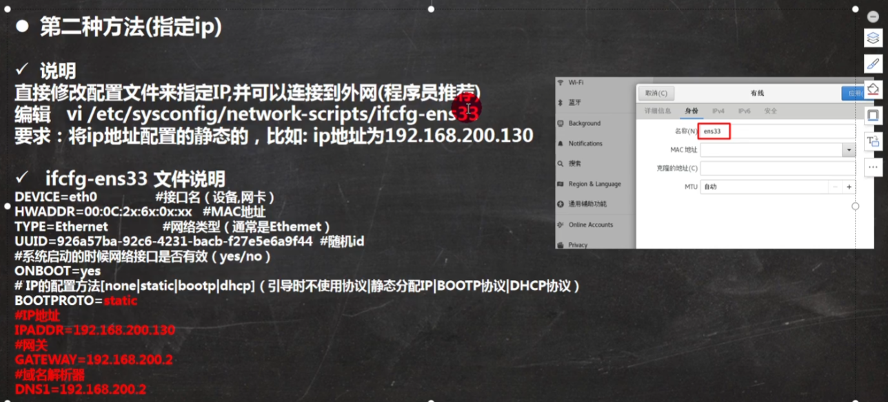

# 网络配置

## NAT网络配置

## 查看网络和网关

查看虚拟器网络编辑器和修改IP地址

* 查看window的网络配置：ipconfig
* 在Linux查看网络配置：ifconfig
* ping指令查看两个主机之间是否可以通讯

## Linux网络环境配置

*  第一种方式（自动获取）

说明：登录后，通过界面自动获取ip，特点：Linux自动获取IP，缺点是每次获取的IP可能不同

* 指定IP

## 设置主机名和当前映射

