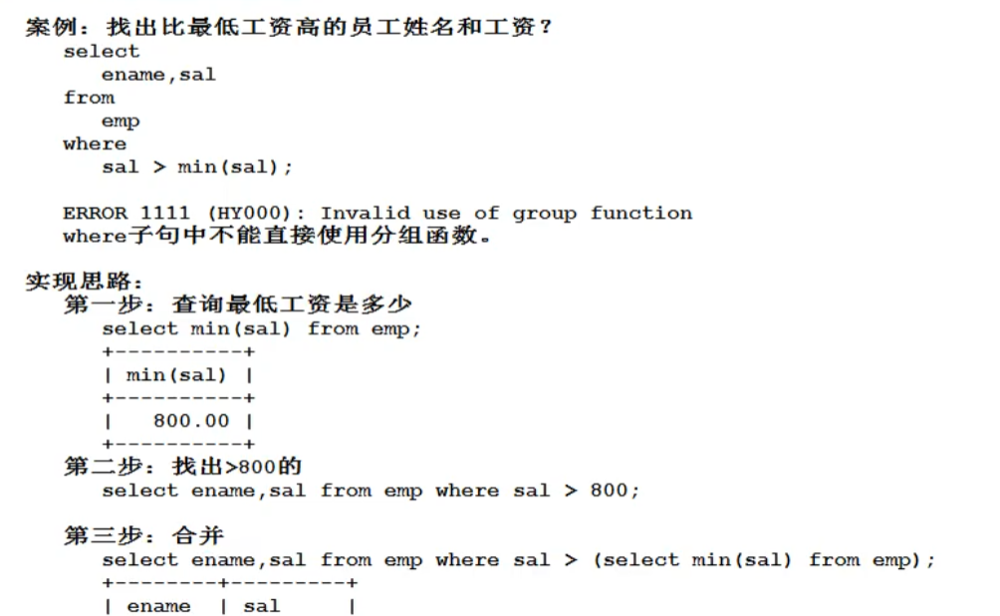

# 数据处理

## 单行处理函数

特定：一个输入对应一个输出，和单行处理函数相对的是多行处理函数：多个输入，对应一个输出

常见的单行处理函数：

* lower 转换小写
* upper 转换大写
* substr 取子串（substr(被截取的字符串，起始下标，截取的子串)，其实下标从一开始
* length 取长度
* cancat 字符串拼接
* length 取长度
* trim 去前后空格
* str_to_data 将字符串转化成日期
* data_format 格式化日期
* format 设置千分位
* round：round(数据，小数位数)：如果小数位数值是一个负值，那么四舍五入到整数位的某一位
* rand 生成随机数：生成随机数的范围为（0，1）
* ifnull 可以将null转化成具体值：为了解决在数据运算中，防止null参与运算的问题，用法：ifnull(数据，填补值)

* case... when  ... then ... when ... then ... else .. end

## 多行处理函数（分组函数）

常见多行处理函数：

* count 计数
* sum 求和
* avg 平均值
* max 最大值
* min 最小值

注意：在使用时，要先进行分组，如果没有进行分组，默认整个表为一组

* 分组函数自动忽略null，不需要对null提前进行处理
* 分组函数中count(*) 和count(具体字段)的区别：前一个是统计表中的总行数，后一个是统计该字段下部位null的个数
* 分组函数不能直接使用再where子句中

### 分组查询

概念：在实际的应用中，可能有这样的需求，需要先进行分组，然后对每一组进行操作，这时候就需要我们分组查询	

```mysql
select 
	...
from 
	...
group by
	...
```

语句的执行顺序：

1. from
2. where
3. group by
4. having
5. select
6. order by

重点结论：

​	在一条select语句的后面，如果有group by语句的话，select后面只能跟：参加分组的字段，分组函数，其他的一律不能用

#### 按照多个字段进行分组

技巧：两个字段联合成一个字段看

group by 字段1,字段2；

### 数据过滤

having 关键字，having不能单独使用，不能代替where，必须和group by 一起使用

注意：使用having语句的效率低，因为是先分组后过滤，那么分组执行后再丢弃数据会有多余的分组查询炒作，所以能先用where语句过滤掉的，优先使用where语句

### distinct去重

对于重复的数据可以去重，distinct只能出现在所有字段的最前方，那么所有字段联合去重

```mysql
select distinct ename,sal from emp;
```

## 连接查询

概念：从一张表中查询数据，叫单表查询，从多个表联合起来查询数据，叫连接查询

连接查询的分类：

* 根据年代

> SQL92
>
> SQL99

* 感觉查询方式

> 内连接：分等值连接，非等值连接，自连接
>
> 外连接：左外连接，右外连接 
>
> 全连接

### 笛卡尔积现象

当两张表进行连接查询，并且没有任何条件限制的时候，最终查询结果条数，是两张表条数的乘积，称为笛卡尔积现象

**如何避免？**

​	连接时加条件，满足条件的筛选出来，但是添加条件的筛选条件不会减少匹配次数

提高效率的方法：

​	表起别名通过 . 符号来获取某个表的数据：emp.ename

原则：减少表的连接次数是提高效率的重要手段	

### 内连接之等值连接

语法：SQL99

```mysql
select ...
from 
	table1
inner join
	table2 
on
	table1 和 table2 的条件
where 
	其他筛选调教
```

inner 可加可不加，可读性更好

### 内连接之非等值连接

条件不是一个等值条件，而是一个非等值条件

```mysql
select 	
	e.name,e.sal,s.grade
from 
	emp e
join 
	salgrade s
on 
	e.sal between s.losal and s.hisal;
```

### 内连接之自连接

技巧：一张表看成两张表，自己和自己连接

## 外连接

内连接是把满足条件的数据筛选出来

如果存在匹配的数据之外，存在某一个数据在另一个表中没有匹配项，但是有希望显示出来，那么我们需要用到外连接

```mysql
select 
	e.ename,d.dname
from 
	emp e
right join
	dept d
on
	e.deptno = d.deptno;
```

right 表示把join关键字右边的表作为主表，把主表中的数据都要显示出来，如果有一个表的数据在另一个表中没有项，那么用null代替

left 表示把join左边的表作为主表

* 带有right的是右外连接
* 带有left的是左外连接

### 多连接

```mysql
select ...
from 
a join b
on ...
join c
on ...
join d
on ...
```

## 子查询

概念：select 语句中嵌套select语句，可以出现在select，where，from后面

### where中的子查询

### from中的子查询

注意：from后面的子查询可以将子查询后面的结果当作临时表

 查询每个岗位平均薪资的薪资水平

### select后面的子查询

略

## union合并查询结果集

用法，就是union两个select结果

```mysql
select ename,job from emp where job in ('manager','salsman');

select ename,job from emp where job = 'manager'
union 
select ename,job from emp where job = 'salsman';
```

注意：union在进行结果集合并的时候，要求两个结果集的列数和列的数据类型相同

## limit

limit 将查询结果集显示一部分，通常用于分页查询中，可以提高用户的体验

```mysql
select
	ename,sal
from 
	emp
order by 
	sec desc
limit 5;
```

用于将薪资前5名的结果打印出来

注意：limit在order by之后执行，它可以有两个参数，分别代表开始下标，取得长度

分页查询的公式：

limit (pagenum-1)*pagesize, pagesize;

## 关于DQL语句的大总结

```mysql
select 
	...
from 
	...
where
	...
group by
	...
having 
	...
order by
	...
limit 
	...
```

执行顺序

1. from
2. where
3. group by
4. having
5. select
6. order by
7. limit 

