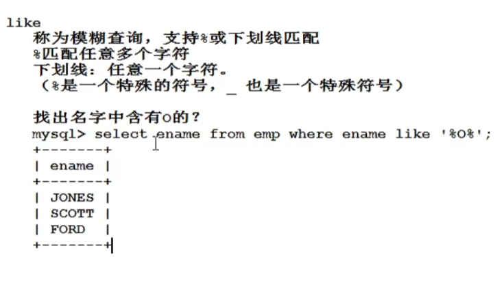
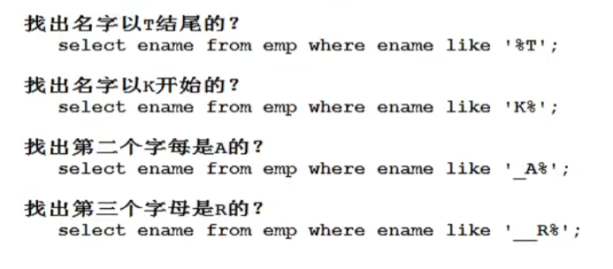
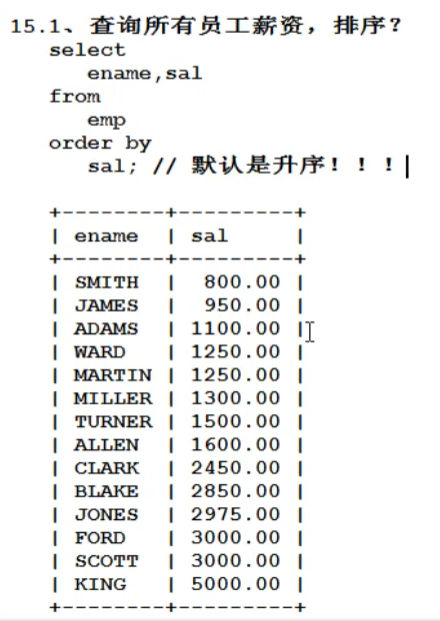

# SQL语句

* 注意：

> sql语句不区分大小写

## DQL

### 简单查询

1. 查询一个字段

select  字段名 from 表名;

2. 查询多个字段

使用‘，’隔开，select 字段名1,字段名2 from 表名;

3. 查询所有，通配符‘*’，效率较低，或者把所有字段名打出来

使用‘*’的缺点：效率低，可读性差

### 给查询的列起别名

使用as关键词，但只是把打印出来的查询结果的列名修改，并不会修改原表数据，并且as可以省略，如果给自己的别名中有空格，可以用单引号，或双引号括起来你起的名字，告诉编译器这是一个名字

注意：再所有的数据库当中，字符串统一用单引号括起来，是标准，再Oracle中，双引号用不了

字段可以参加数学运算，比如：select ename,sal*12 as '年薪' from emp;

### 条件查询

查询出来符合条件的数据

语法格式：

```sql
select
	...
from 
	表名
where
	条件;
```

#### 查询条件

* 等于=，不等于！=或<> ,大于，小于，大于等于，小于等于
* 在某个区间，between ... and ... ，等同于 >= ... and  <= ...，使用between and时候必须左小右大
* 是否为空，is null 和 null，不为null：is not null，在数据库中null不能用=进行衡量
* 逻辑连词，and ，or，表示和，或；and和or同时出现的话，有优先级问题，先执行and，不过我们可以通过加括号的方式来修改优先级
* in 包含，not in 不包含，用()包含选项
* not 可以取非，主要用在is 和 in中
* 模糊查询，





对于查询有%和_的选项，我们可以用\转义

## 排序

order by 排序的项，默认是升序



#### 怎么降序：可以在后面加入desc来降序,指定asc升序

```mysql
select ename,sal from emp order by sal desc;
```

#### 多条件排序

```mysql
select ename,sal from emp order by sal asc, ename asc;
```

按照薪资排序，如果一样再按照名字排序

#### 根据字段的位置排序

```mysql
select ename,sal from emp order by 2;
```

按照查询结果的第二列排序，不建议再开发中这样写

