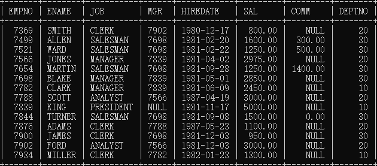
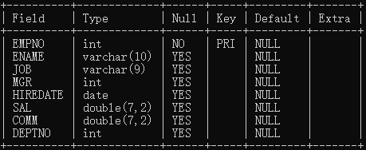

# 数据库入门

## 数据库，数据库管理器，SQL

数据库（database，简称DB）：按照一定格式存储数据的一些文件的组合，顾名思义：存储数据的仓库，实际就是一些文件，这些文件中存储具有特定格式的数据

数据库管理系统（DataBaseManagement，简称DBMS）：数据库管理系统可以对数据库当中的数据进行增删改查，常见的DBMS有：MySQL，Oracle，db2等

SQL：结构化查询语言，通过编写SQL语句，然后DBMS，负责执行SQL语句，然后实行数据库中数据的增删改查

三者关系:

> DBMS --执行--> SQL --操作--> DB

## 命令启停MySQL服务

语法：

> net start 服务名
>
> net stop  服务名

## MySQL常用命令

注意：命令可不区分大小写

### mysql登录和推出

登录：mysql -uroot -p

推出：exit

## 查看，使用，创建数据库

都是以分号结尾,mysql不见分号不执行

* 查看：show databases;
* 使用：use 数据库名; 如果使用成功会有 Databases changed信息
* 创建：create database 数据库名; 

## 其他命令：

* 查看版本号：select version();
* 查看当前使用的数据库：select database();

## 表：table

table 是数据库当中最基本的存储单元，

什么是表，为什么用表存储数据：数据库当中以表格的形式存储数据，因为表比较直观，任何一个表都有行和列

* 行：被称为数据/记录
* 列：被称为字段，每一个字段都有字段名，数据类型，约束等属性

查看数据库的表：show tables;

## SQL语句的分类

* DQL(data query)：数据查询语言，带有select关键字
* DML(data manipulation)：数据操作语言，对数据表中的数据进行增删改包括insert，delete，update
* DDL(data definition)：数据定义语言，带有create ，drop，alter的都是ddl，操作表的结构，不是数据
* TCL(thing control)：事务控制语言，包括事物提交commit，事物回滚rollback
* DCL(data control)：数据控制语言，授权grant，撤销权限revoke...

### 导入数据，指定数据库

导入数据语法：source

举例：mysql> source 文件路径

注意：路径中不能有中文

### 查看表格数据

查看表的所有数据：select * from 表名;

### 查看表的结构

desc 表名;(desc是describe的缩写)

表的结构，Field是字段名，Type是数据类型

## sql脚本文件

xxx.sql是sql脚本文件，用于编写sql语句

执行方式：source 文件路径