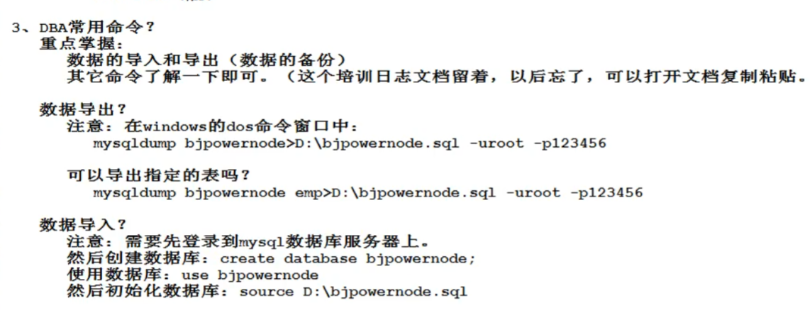

# 存储引擎

概念：存储引擎是MySQL中特有的术语，其他数据库中没有（Oracle中有，但是不叫这个名字）

实际上存储引擎是一个表存储/组织数据的方式，不同的存储引擎，数据的存储/组织形式不同

## 指定存储引擎

```mysql
show create table t_student; // 查看表的存储引擎
```

在建表的时候指定存储引擎，engine等于

show engine 查看mysql有哪些存储引擎

mysql支持9大存储引擎

## 常用存储引擎

* innoDB：安全但是效率较低
* MyISAM

管理的表具有一下特征，使用三个文件存储一个表：格式文件，数据文件，索引文件

> 格式文件：存储表结构的定义 (mytable.frm)
>
> 数据文件：存储表的内容(mytable.MYD)
>
> 索引文件：存储表上索引(mytable.MYI):索引等于一本书的目录，可以提高表的搜索效率

* MEMORY：查询最快，因为数据全部存在内存总，但是不安全

# 索引

索引在数据库表的字段上添加，为了提高查询效率存在的机制，一张表的一个字段添加一个索引，也可以多个字段联合起来添加一个索引，可以缩小扫描范围的一种机制

mysql查询方式：

1. 全局扫描
2. 根据索引检索

提醒：

* 任何数据库都会给主键添加索引，如果一个字段有unique特性的话，那么也会添加索引
* 任何数据库中，任何一张表的任何记录在硬盘存储上都有一个硬盘的物理存储编号
* 在mysql中，索引是一个单独的存储对象，在mysql中，索引以一个平衡二叉树的形式存在

## 人为添加索引

添加索引的条件：建议不要随意添加索引

1.  数据量庞大
2. 字段经常出现在where的后面，以条件的形式存在
3. 该字段很少被DML操作

创建索引：

```mysql
create index emp_ename_index on emp(ename); 
```

给emp表的ename字段添加索引，起名：emp_ename_index

删除索引：

```mysql
drop index emp_ename_index index on emp;
```

查看是否使用索引进行检索：

```mysql
explain select * from emp where ename='KING';
```

## 索引失效

1. 模糊查询以%开始，那么索引失效
2. 使用or的情况：如果其中一个字段没有索引，那么索引失效，也就是说or的两边必须都有索引才会走索引，所以可以用union代替or
3. 使用复合索引的时候，没有使用左侧的列查找，索引失效
4. 在where当中索引列参加了运算，索引失效
5. 在where中索引列参加了函数

## 索引分类：

* 单一索引
* 复合索引
* 主键索引
* 唯一性索引

## 总结

索引是各种数据库进行优化的重要手段

# 视图view

站在不同角度看同一份数据

## 创建，删除试图

创建：

```mysql
create view dept2_view as select * from dept2;
```

删除：

```
drop view dept2_view;
```

我们可以对试图进行增删改查，会导致原表数据改变

视图的作用其实是封装DQL语句

# DBA命令

数据导入和导出



# 数据库设计范式

三大范式：

1. 要求任何一个表中都有一个主键，每一个字段原子性不可再分
2. 要求所有非主键字段完全依赖主键，不要产生部分依赖
3. 要求所有非主键字段直接依赖主键，不要产生传递依赖

范式设计的目的：不产生数据的冗余

表的设计：

1. 一对多：两张表，加一个外键
2. 多对多：三张表，加二个外键
3. 一对一：大部分可以用一个表，当字段多的时候，可以考虑拆分表