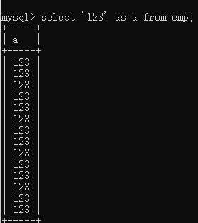

# 问题汇总

## 解决ERROR 1046,NO database selected

这个问题是说你没有选择数据库，先创建或使用数据库后再导入数据就可以了

## 查询字面量的结果

如果你select 的 字段值使用一个字面量，mysql会借助你的表结构生成数据

## for the right syntax to use near 'maxsal from emp group by job' at line 1

关键词冲突，把命名时加入‘’

## ERROR 1248 (42000): Every derived table must have its own alias

设计多级查询的时候，需要给予表名

