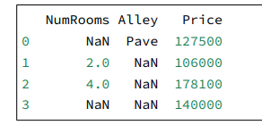
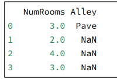
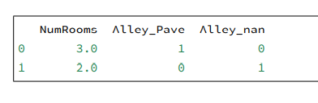

# pytorch应用以及数据处理

​	所有机器学习⽅法都涉及从数据中提取信息 我们 先学习⼀些关于数据的实⽤技能，包括存储、操作和预处理数据。  

​	深度学习是关于优化的学习。对于⼀个带有参数的模型，我们想要找到其中能拟合数据的最好模型。在算 法的每个步骤中，决定以何种⽅式调整参数需要⼀点微积分知识。本章将简要介绍这些知识。幸运的是， autograd包会⾃动计算微分，本章也将介绍它。  

## 数据操作

​	为了能够完成各种数据操作，我们需要某种⽅法来存储和操作数据。通常，我们需要做两件重要的事：（1） 获取数据；（2）将数据读⼊计算机后对其进⾏处理。如果没有某种⽅法来存储数据，那么获取数据是没有意 义的。 

​	⾸先，我们介绍n维数组，也称为张量（tensor）。使⽤过Python中NumPy计算包的读者会对本部分很熟悉。 ⽆论使⽤哪个深度学习框架，它的张量类（在MXNet中为ndarray，在PyTorch和TensorFlow中为Tensor） 都与Numpy的ndarray类似。但深度学习框架⼜⽐Numpy的ndarray多⼀些重要功能：⾸先，GPU很好地 ⽀持加速计算，而NumPy仅⽀持CPU计算；其次，张量类⽀持⾃动微分。这些功能使得张量类更适合深度学 习。如果没有特殊说明，本书中所说的张量均指的是张量类的实例。 

### 基础入门

```python
import torch
# 注意这里是导入torch 而不是 pytorch
x = torch.arrange(12)
# 同np.arange , 生成1-12的数字
x.shape
# 访问张量的shape属性，从而获取张量形状
x.numel()
# 获取张量的的size，从而得知元素个数
X = x.reshape(3,4)
# 转变张量的形状，我们可以使用-1自动计算出维度，比如可以将上面的转化为X.reshape(-1,4)或x.reshape(3,-1)
torch.zeros((2,3,4))
torch.ones((2,3,4))
torch.randn(3,4)
# zeros生成零张量，ones生成1张量，randn生成满足标准高斯发布的数据
torch.tensor(可迭代数据类型)
# 同numpy.array()
```

### 运算符

​	我们的兴趣不仅限于读取数据和写⼊数据。我们想在这些数据上执⾏数学运算，其中最简单且最有⽤的操作 是按元素（elementwise）运算。 

 对于任意具有相同形状的张量，常⻅的标准算术运算符（+、-、*、/和**）都可以被升级为按元素运算。我 们可以在同⼀形状的任意两个张量上调⽤按元素操作。在下⾯的例⼦中，我们使⽤逗号来表⽰⼀个具有5个 元素的元组，其中每个元素都是按元素操作的结果。 

```python
x = torch.tensor([1.0,2,4,8])
y = torch.tensor([2,2,2,2])
x + y , x - y, x*y,x/y,x**y
"""
x+y:(tensor([3.,4.,6.,10.])),
x-y:tensor([-1., 0., 2., 6.]),
x*y:tensor([ 2., 4., 8., 16.]),
x/y:tensor([0.5000, 1.0000, 2.0000, 4.0000]),
x**y:tensor([ 1., 4., 16., 64.]))
"""
torch.exp(x)
# 部分函数是按元素操作
```

 我们也可以把多个张量连结（concatenate）在⼀起，把它们端对端地叠起来形成⼀个更⼤的张量。我们只需 要提供张量列表，并给出沿哪个轴连结。下⾯的例⼦分别演⽰了当我们沿⾏（轴-0，形状的第⼀个元素）和按 列（轴-1，形状的第⼆个元素）,我们把这种运算定义为指定方向运算

```python
X = torch.arange(12,dtype=torch.float32).reshape(3,4)
Y = torch.tensor([[2.0,1,4,3],[1,2,3,4],[4,3,2,1]])
torch.cat((X,Y),dim=0),torch.cat((X,Y),dim=1)
```

### 广播机制

略

### 索引和切片

​	就像在任何其他Python数组中⼀样，张量中的元素可以通过索引访问。与任何Python数组⼀样：第⼀个元素 的索引是0，最后⼀个元素索引是-1；可以指定范围以包含第⼀个元素和最后⼀个之前的元素。 

**同numpy操作**

### 节省内存

​	运⾏⼀些操作可能会导致为新结果分配内存。例如，如果我们⽤Y = X + Y，我们将取消引⽤Y指向的张量， 而是指向新分配的内存处的张量。 

​	幸运的是，执⾏原地操作⾮常简单。我们可以使⽤切⽚表⽰法将操作的结果分配给先前分配的数组，例 如Y[:] = 。为了说明这⼀点，我们⾸先创建⼀个新的矩阵Z，其形状与另⼀个Y相同， 使⽤zeros_like来分配⼀个全0的块。 如果在后续计算中没有重复使⽤X，我们也可以使⽤**X[:] = X + Y或X += Y**来减少操作的内存开销。 

## 数据预处理

### 读取数据集

我们用pandas包并调用read_csv函数读取csv函数

```python
import pandas as pd

data = pd.read_csv(data_file)
print(data)
```



### 处理缺失值

​	注意，“NaN”项代表缺失值。为了处理缺失的数据，典型的⽅法包括插值法和删除法，其中插值法⽤⼀个替 代值弥补缺失值，而删除法则直接忽略缺失值。在这⾥，我们将考虑插值法。 

​	通过位置索引iloc，我们将data分成inputs和outputs，其中前者为data的前两列，而后者为data的最 后⼀列。对于inputs中缺少的数值，我们⽤同⼀列的均值替换“NaN”项。 

```python
inputs,outputs = data.iloc[0,0:2],data[:,2]
inputs = inputs.fillna(inputs.mean())
print(inputs)
```

	这里把第一列的nan值替换成了所在列存在数据的平均数

​	对于inputs中的类别值或离散值，我们将“NaN”视为⼀个类别。由于“巷⼦类型”（“Alley”）列只接受两 种类型的类别值“Pave”和“NaN”，pandas可以⾃动将此列转换为两列“Alley_Pave”和“Alley_nan”。巷 ⼦类型为“Pave”的⾏会将“Alley_Pave”的值设置为1，“Alley_nan”的值设置为0。缺少巷⼦类型的⾏会 将“Alley_Pave”和“Alley_nan”分别设置为0和1。 

```python
inputs = pd.get_dummies(inputs,dummy_na=True)
print(inputs)
```



### 转化成张量形式

```python
import torch
X,y = torch.tensor(inputs.values),torch.tensor(outputs.values)
```

## 线性代数

### 标量

​	我们采⽤了数学表⽰法，其中标量变量由普通小写字⺟表⽰（例如，x、y和z）。我们⽤R表⽰所 有（连续）实数标量的空间。我们之后将严格定义空间（space）是什么，但现在你只要记住表达式x ∈ R是表 ⽰x是⼀个实值标量的正式形式。符号∈称为“属于”，它表⽰“是集合中的成员”。我们可以⽤x, y ∈ {0, 1}来 表明x和y是值只能为0或1的数字。  

### 向量

​	你可以将向量视为标量值组成的列表。我们将这些标量值称为向量的元素（element）或分量（component）。 当向量表⽰数据集中的样本时，它们的值具有⼀定的现实意义。 

* 长度，维度和形状

len()访问长度返回整数，shape返回形状元组，张量的维度便是具有轴的数量

### 矩阵

* 转置A.T

### 点积

​	点积在很多场合都很有⽤。例如，给定⼀组由向量x ∈ R d表⽰的值，和⼀组由w ∈ R d表⽰的权重。x中的值 根据权重w的加权和，可以表⽰为点积x ⊤w。当权重为⾮负数且和为1（即(∑d i=1 wi = 1) ）时，点积表⽰加 权平均（weighted average）。将两个向量规范化得到单位⻓度后，点积表⽰它们夹⻆的余弦。我们将在本节 的后⾯正式介绍⻓度（length）的概念。 

```python
x = torch.ones(4,dtype=torch.float32)
x,y,torch.dot(x,y)
```

* 矩阵-向量积：torch.mv()
* 矩阵-矩阵积：torch.mm()

### 范数

torch.norm

## 微积分和自动微分

### 标量的反向传播

​	深度学习框架通过⾃动计算导数，即⾃动微分（automatic differentiation）来加快求导。实际中，根据我们 设计的模型，系统会构建⼀个计算图（computational graph），来跟踪计算是哪些数据通过哪些操作组合起 来产⽣输出。⾃动微分使系统能够随后反向传播梯度。这⾥，反向传播（backpropagate）意味着跟踪整个计 算图，填充关于每个参数的偏导数。 

```python
import torch 
x = torch.arange(4.0)
```

 	在我们计算y关于x的梯度之前，我们需要⼀个地⽅来存储梯度。重要的是，我们不会在每次对⼀个参数求导 时都分配新的内存。因为我们经常会成千上万次地更新相同的参数，每次都分配新的内存可能很快就会将内 存耗尽。注意，⼀个标量函数关于向量x的梯度是向量，并且与x具有相同的形状。 

```python
x.requires_grad_(True)
y = 2 * torch.dot(x,x)
```

​	 x是⼀个⻓度为4的向量，计算x和x的点积，得到了我们赋值给y的标量输出。接下来，我们通过调⽤反向传 播函数来⾃动计算y关于x每个分量的梯度，并打印这些梯度。  

```python
y.backward()
x.grad
```

### 非标量变量的反向传播

 	当y不是标量时，向量y关于向量x的导数的最⾃然解释是⼀个矩阵。对于⾼阶和⾼维的y和x，求导的结果可 以是⼀个⾼阶张量。 


## 资源

 [d2l-zh-pytorch.pdf](file:///E:/笔记/学习文档/d2l-zh-pytorch.pdf) 动手学习深度学习

 [主页 - PyTorch中文文档 (pytorch-cn.readthedocs.io)](https://pytorch-cn.readthedocs.io/zh/latest/) 